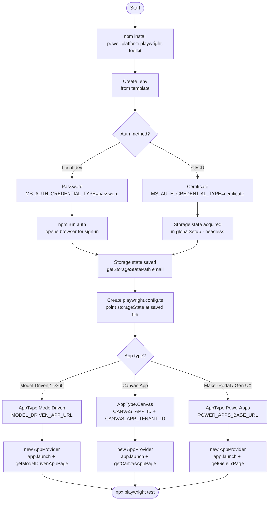

<div align="center">
  <h1><strong>Power Platform Playwright Samples</strong></h1>

[](https://github.com/microsoft/power-platform-playwright-samples/actions/workflows/ci.yml)
[](https://www.npmjs.com/package/power-platform-playwright-toolkit)
[](https://www.typescriptlang.org/)
[](https://playwright.dev/)
[](https://opensource.org/licenses/MIT)
[](https://nodejs.org/)

  <p><strong>Official Playwright automation toolkit and sample tests for Microsoft Power Platform</strong></p>
  <p>A production-ready testing framework for Canvas Apps, Model-Driven Apps, Custom Pages, and Gen UX — with built-in Microsoft authentication, intelligent waiters, and a composable Page Object Model.</p>
</div>

---

## Packages

This monorepo contains three packages:

| Package                                                                                      | Description                                                            |
| -------------------------------------------------------------------------------------------- | ---------------------------------------------------------------------- |
| [`packages/power-platform-playwright-toolkit/`](packages/power-platform-playwright-toolkit/) | Core library — published to npm as `power-platform-playwright-toolkit` |
| [`packages/e2e-tests/`](packages/e2e-tests/)                                                 | Sample tests demonstrating real-world usage patterns                   |
| [`packages/docs/`](packages/docs/)                                                           | Documentation site (Nextra/Next.js)                                    |

---

## Using the npm Package



### Prerequisites

- Node.js 20+
- An M365 / Dynamics 365 tenant with a test user account
- Microsoft Edge (recommended) or Chromium

### 1. Install

```bash
npm install power-platform-playwright-toolkit @playwright/test --save-dev
```

Install browser binaries (first time only):

```bash
npx playwright install msedge
```

### 2. Configure environment variables

Create a `.env` file in your project root. All available variables:

```bash
# =============================================================================
# Power Apps / Maker Portal
# =============================================================================
POWER_APPS_BASE_URL=https://make.powerapps.com
POWER_APPS_ENVIRONMENT_ID=Default-00000000-0000-0000-0000-000000000000

# =============================================================================
# Model-Driven App
# =============================================================================
# Full URL — open your MDA in the browser and copy the URL including ?appid=
MODEL_DRIVEN_APP_URL=https://your-org.crm.dynamics.com/main.aspx?appid=00000000-0000-0000-0000-000000000000

# =============================================================================
# Canvas App
# =============================================================================
# Option A: Component IDs (toolkit builds the play URL automatically)
CANVAS_APP_ID=00000000-0000-0000-0000-000000000000
CANVAS_APP_TENANT_ID=00000000-0000-0000-0000-000000000000

# Option B: Full play URL (takes precedence over IDs if set)
# CANVAS_APP_URL=https://apps.powerapps.com/play/e/<env-id>/a/<app-id>?tenantId=<tenant-id>

# =============================================================================
# Microsoft Authentication (playwright-ms-auth)
# =============================================================================
MS_AUTH_EMAIL=user@contoso.com

# Password auth (simplest for local dev)
MS_AUTH_CREDENTIAL_TYPE=password
MS_AUTH_CREDENTIAL_PROVIDER=environment
MS_AUTH_ENV_VARIABLE_NAME=MS_USER_PASSWORD
MS_USER_PASSWORD=your-password-here

# Certificate auth (recommended for CI/CD)
# MS_AUTH_CREDENTIAL_TYPE=certificate
# MS_AUTH_CREDENTIAL_PROVIDER=local-file
# MS_AUTH_LOCAL_FILE_PATH=./cert/your-cert.pfx
# MS_AUTH_CERTIFICATE_PASSWORD=your-cert-password

MS_AUTH_HEADLESS=true
MS_AUTH_WAIT_FOR_MSAL_TOKENS=true
MS_AUTH_MSAL_TOKEN_TIMEOUT=30000
AUTH_ENDPOINT=https://login.microsoftonline.com

# =============================================================================
# Test Runner
# =============================================================================
HEADLESS=true
WORKERS=1
RETRIES=0
TEST_TIMEOUT=120000
OUTPUT_DIRECTORY=./test-results
```

### 3. Set up Playwright config

```typescript
// playwright.config.ts
import { defineConfig } from '@playwright/test';
import dotenv from 'dotenv';
import { getStorageStatePath, TimeOut, ConfigHelper } from 'power-platform-playwright-toolkit';

dotenv.config();

export default defineConfig({
  testDir: './tests',
  timeout: 120_000,
  fullyParallel: false,
  retries: process.env.CI ? 1 : 0,

  use: {
    channel: 'msedge',
    headless: process.env.HEADLESS !== 'false',
    viewport: { width: 1920, height: 1080 },
    baseURL: ConfigHelper.getBaseUrl(),
    storageState: process.env.MS_AUTH_EMAIL
      ? getStorageStatePath(process.env.MS_AUTH_EMAIL)
      : undefined,
    screenshot: 'only-on-failure',
    video: 'on',
    trace: 'retain-on-failure',
    actionTimeout: TimeOut.OneMinuteTimeOut,
    navigationTimeout: TimeOut.OneMinuteTimeOut,
    ignoreHTTPSErrors: true,
    locale: 'en-US',
  },

  expect: {
    timeout: TimeOut.DefaultWaitTime,
  },
});
```

### 4. Authenticate (first time)

The toolkit uses [`playwright-ms-auth`](https://www.npmjs.com/package/playwright-ms-auth) to acquire and cache browser storage state (cookies + localStorage) so tests do not re-authenticate on every run.

Add a helper script to your `package.json`:

```json
{
  "scripts": {
    "auth": "playwright-ms-auth --headed"
  }
}
```

Run it once to open a browser and complete sign-in:

```bash
npm run auth
```

The saved state file is written to the path returned by `getStorageStatePath(email)` and picked up automatically by the Playwright config above.

> In CI, supply credentials via environment variables (`MS_AUTH_CREDENTIAL_TYPE=password` or `certificate`). The storage state is acquired headlessly during `globalSetup`.

### 5. Write tests

#### Model-Driven App

```typescript
import { test, expect } from '@playwright/test';
import { AppProvider, AppType } from 'power-platform-playwright-toolkit';

test('navigate grid and open a record', async ({ page, context }) => {
  const app = new AppProvider(page, context);

  await app.launch({
    app: 'Accounts',
    type: AppType.ModelDriven,
    directUrl: process.env.MODEL_DRIVEN_APP_URL!,
    skipMakerPortal: true,
  });

  const mda = app.getModelDrivenAppPage();

  // Navigate to the Accounts grid view
  await mda.grid.navigateToGridView();
  const rowCount = await mda.grid.getRowCount();
  expect(rowCount).toBeGreaterThan(0);

  // Open the first row
  await mda.grid.openRow(0);

  // Read and update a form field
  const name = await mda.form.getEntityAttribute('name');
  expect(name).toBeTruthy();

  await mda.form.setEntityAttribute('description', 'Updated by Playwright');
  await mda.form.saveForm();
  expect(await mda.form.isFormDirty()).toBe(false);
});
```

#### Canvas App

```typescript
import { test, expect } from '@playwright/test';
import { AppProvider, AppType, buildCanvasAppUrlFromEnv } from 'power-platform-playwright-toolkit';

test('interact with a canvas app control', async ({ page, context }) => {
  const app = new AppProvider(page, context);

  await app.launch({
    app: 'My Canvas App',
    type: AppType.Canvas,
    directUrl: buildCanvasAppUrlFromEnv(), // reads CANVAS_APP_ID + CANVAS_APP_TENANT_ID
  });

  const canvas = app.getCanvasAppPage();

  await canvas.clickControl('Submit Button');
  await canvas.waitForScreen('Confirmation Screen');

  const label = await canvas.getLabelText('Status Label');
  expect(label).toBe('Submitted successfully');
});
```

#### Gen UX (AI-generated apps in the Maker Portal designer)

```typescript
import { test, expect } from '@playwright/test';
import { AppProvider, AppType } from 'power-platform-playwright-toolkit';

test('verify gen-ux app preview', async ({ page, context }) => {
  const app = new AppProvider(page, context);

  await app.launch({
    app: 'My Gen UX App',
    type: AppType.PowerApps,
    directUrl: process.env.POWER_APPS_BASE_URL!,
  });

  const genUx = app.getGenUxPage();
  await genUx.waitForDesignerReady();

  // Interact with the UCI Preview iframe
  const preview = await genUx.getPreviewFrame();
  await preview.locator('[data-testid="submit-btn"]').click();
});
```

---

## API Reference

### Core

| Export                       | Description                                                     |
| ---------------------------- | --------------------------------------------------------------- |
| `AppProvider`                | Entry point — launch any app type, exposes typed page objects   |
| `AppLauncherFactory`         | Lower-level factory for creating app launchers directly         |
| `URLBuilder`                 | Construct Maker Portal URLs programmatically                    |
| `PowerPlatformNavigator`     | Navigate between Power Platform sections                        |
| `ConfigHelper`               | Read environment variables with defaults (`getBaseUrl()`, etc.) |
| `getStorageStatePath(email)` | Resolve the storage state file path for a given user            |

### Page Objects

| Export               | App type                       | Key methods                                           |
| -------------------- | ------------------------------ | ----------------------------------------------------- |
| `ModelDrivenAppPage` | Model-Driven / Dynamics 365    | `.form`, `.grid`, `.commanding`                       |
| `CanvasAppPage`      | Canvas Apps                    | `clickControl()`, `getLabelText()`, `waitForScreen()` |
| `GenUxPage`          | Maker Portal / Gen UX designer | `waitForDesignerReady()`, `getPreviewFrame()`         |
| `PowerAppsPage`      | Maker Portal general           | Navigation, solutions, app management                 |

### Model-Driven components

| Export                | Description                                                                                             |
| --------------------- | ------------------------------------------------------------------------------------------------------- |
| `FormComponent`       | `getEntityAttribute()`, `setEntityAttribute()`, `saveForm()`, `isFormDirty()`, `executeInFormContext()` |
| `GridComponent`       | `navigateToGridView()`, `getRowCount()`, `openRow()`, `searchGrid()`                                    |
| `CommandingComponent` | Interact with the ribbon / command bar                                                                  |

### Locators

| Export                               | Description                                      |
| ------------------------------------ | ------------------------------------------------ |
| `getCanvasDataTestId(id)`            | Selector for Canvas `data-testid` attributes     |
| `getCanvasControlByName(name)`       | Selector for Canvas controls by name             |
| `getCanvasScreenByName(name)`        | Selector for Canvas screens by name              |
| `getModelDrivenDataAutomationId(id)` | Selector for MDA `data-automation-id` attributes |
| `getModelDrivenTablePage(entity)`    | Selector for MDA entity grid pages               |
| `getModelDrivenFormField(field)`     | Selector for MDA form fields                     |
| `getModelDrivenNavItem(item)`        | Selector for MDA navigation items                |

### Types and enums

| Export              | Values                                                                                               |
| ------------------- | ---------------------------------------------------------------------------------------------------- |
| `AppType`           | `Canvas`, `ModelDriven`, `Portal`, `PowerApps`                                                       |
| `AppLaunchMode`     | `play`, `edit`, `preview`                                                                            |
| `CanvasControlType` | `Button`, `TextInput`, `Label`, `Dropdown`, `Gallery`, `Form`, `Checkbox`, `Toggle`, `DatePicker`, … |
| `EndPointURL`       | `/home`, `/apps`, `/solutions`, `/flows`, `/connections`, …                                          |
| `TimeOut`           | `DefaultWaitTime`, `OneMinuteTimeOut`, …                                                             |

### Waiters

| Export                | Waits for               |
| --------------------- | ----------------------- |
| `AppRuntimeWaiter`    | App runtime to be ready |
| `HomePageWaiter`      | Maker Portal home page  |
| `AppsPageWaiter`      | Apps listing page       |
| `SolutionsPageWaiter` | Solutions page          |

---

## Architecture

```
Your Test Project
      │
      │  npm install power-platform-playwright-toolkit
      ▼
┌─────────────────────────────────────────────────────────┐
│           power-platform-playwright-toolkit              │
├──────────────────────────────┬──────────────────────────┤
│  AppProvider (entry point)   │  Page Object Model        │
│  AppLauncherFactory          │  • ModelDrivenAppPage     │
│  Authentication helpers      │  • CanvasAppPage          │
│  Page waiters                │  • GenUxPage              │
│  Locator utilities           │  • FormComponent          │
│  URL builders                │  • GridComponent          │
│                              │  • CommandingComponent    │
└──────────────────────────────┴──────────────────────────┘
      │
      │  uses
      ▼
playwright-ms-auth  +  @playwright/test
```

---

## Getting Started from Source

```bash
# Clone
git clone https://github.com/microsoft/power-platform-playwright-samples.git
cd power-platform-playwright-samples

# Install Rush (monorepo manager)
npm install -g @microsoft/rush

# Install dependencies
rush install

# Build all packages
rush build
```

### Run the sample tests

#### Step 1 — Set up environment variables

The tests read all configuration from a `.env` file inside `packages/e2e-tests/`. Copy the example and fill in your values:

```bash
cd packages/e2e-tests
cp .env.example .env
```

Then open `packages/e2e-tests/.env` and assign values to every variable:

```bash
# -----------------------------------------------------------------------
# Power Apps / Maker Portal
# -----------------------------------------------------------------------
# Base URL of the Maker Portal (leave as-is unless using a preview URL)
POWER_APPS_BASE_URL=https://make.powerapps.com

# Your environment GUID — find it in the Maker Portal URL:
#   make.powerapps.com/environments/<GUID>/...
POWER_APPS_ENVIRONMENT_ID=Default-00000000-0000-0000-0000-000000000000

# -----------------------------------------------------------------------
# Model-Driven App
# -----------------------------------------------------------------------
# Full URL of your MDA including the ?appid= parameter.
# How to find: open your app in the browser and copy the URL.
MODEL_DRIVEN_APP_URL=https://your-org.crm.dynamics.com/main.aspx?appid=00000000-0000-0000-0000-000000000000

# -----------------------------------------------------------------------
# Canvas App
# -----------------------------------------------------------------------
# Option A — component IDs (toolkit builds the play URL automatically):
#   App ID:    Maker Portal → select app → Details → App ID
#   Tenant ID: Azure Portal → Azure Active Directory → Overview → Tenant ID
CANVAS_APP_ID=00000000-0000-0000-0000-000000000000
CANVAS_APP_TENANT_ID=00000000-0000-0000-0000-000000000000

# Option B — full play URL (takes precedence over IDs above if set):
# CANVAS_APP_URL=https://apps.powerapps.com/play/e/<env-id>/a/<app-id>?tenantId=<tenant-id>

# -----------------------------------------------------------------------
# Microsoft Authentication
# -----------------------------------------------------------------------
# The email address of the test user account
MS_AUTH_EMAIL=user@contoso.com

# Password authentication (simplest for local development):
MS_AUTH_CREDENTIAL_TYPE=password
MS_AUTH_CREDENTIAL_PROVIDER=environment
MS_AUTH_ENV_VARIABLE_NAME=MS_USER_PASSWORD
MS_USER_PASSWORD=your-password-here

# Certificate authentication (recommended for CI/CD — uncomment to use):
# MS_AUTH_CREDENTIAL_TYPE=certificate
# MS_AUTH_CREDENTIAL_PROVIDER=local-file
# MS_AUTH_LOCAL_FILE_PATH=./cert/your-cert.pfx
# MS_AUTH_CERTIFICATE_PASSWORD=your-cert-password

# Run the auth browser headlessly (set to false to watch the sign-in)
MS_AUTH_HEADLESS=true
MS_AUTH_WAIT_FOR_MSAL_TOKENS=true
MS_AUTH_MSAL_TOKEN_TIMEOUT=30000
AUTH_ENDPOINT=https://login.microsoftonline.com

# -----------------------------------------------------------------------
# Test Runner
# -----------------------------------------------------------------------
HEADLESS=true
WORKERS=1
RETRIES=0
TEST_TIMEOUT=120000
OUTPUT_DIRECTORY=./test-results
```

> All variable descriptions and available options are documented in
> [`packages/e2e-tests/.env.example`](packages/e2e-tests/.env.example).

#### Step 2 — Authenticate

Run this once to open a browser, complete Microsoft sign-in, and save the session:

```bash
npm run auth:headful
```

#### Step 3 — Run tests

```bash
# Run all tests
npx playwright test

# Run a specific project
npx playwright test --project=model-driven-app
npx playwright test --project=default        # canvas + maker portal
npx playwright test --project=gen-ux
```

---

## Monorepo Structure

```
power-platform-playwright-samples/
├── packages/
│   ├── power-platform-playwright-toolkit/  # npm library
│   │   ├── src/
│   │   │   ├── core/           # AppProvider, AppLauncherFactory, waiters
│   │   │   ├── components/     # ModelDrivenAppPage, CanvasAppPage, GenUxPage
│   │   │   │   ├── model-driven/   # FormComponent, GridComponent, CommandingComponent
│   │   │   │   ├── canvas/         # CanvasAppPage
│   │   │   │   └── gen-ux/         # GenUxPage
│   │   │   ├── auth/           # Authentication helpers
│   │   │   ├── locators/       # Locator repositories
│   │   │   ├── types/          # TypeScript interfaces & enums
│   │   │   └── utils/          # Helper functions
│   │   └── dist/               # Compiled output
│   ├── e2e-tests/              # Sample test infrastructure
│   │   ├── tests/              # Test files (mda/, canvas/, gen-ux/)
│   │   ├── pages/              # Custom Page Object Models
│   │   ├── utils/              # Test utilities and shared steps
│   │   └── playwright.config.ts
│   └── docs/                   # Documentation site (Nextra)
├── common/                     # Rush configuration
├── rush.json
└── .github/workflows/          # CI/CD pipelines
```

---

## Documentation

> Documentation site coming soon. In the meantime, generate and browse the API docs locally:
>
> ```bash
> cd packages/power-platform-playwright-toolkit
> npm run docs        # generates docs/
> npm run docs:serve  # watches and serves
> ```
>
> The sample tests in [`packages/e2e-tests/`](packages/e2e-tests/) are the best reference for real-world usage patterns.

---

## Contributing

Contributions are welcome! Please read [CONTRIBUTING.md](CONTRIBUTING.md) and follow the [Microsoft Open Source Code of Conduct](https://opensource.microsoft.com/codeofconduct/).

1. Fork the repository
2. Create a feature branch: `git checkout -b feat/my-feature`
3. Make changes in `packages/power-platform-playwright-toolkit/src/`
4. Build: `rush build`
5. Test: `cd packages/e2e-tests && npx playwright test`
6. Submit a pull request to `main`

---

## Trademarks

This project may contain trademarks or logos for projects, products, or services. Authorized use of Microsoft
trademarks or logos is subject to and must follow
[Microsoft's Trademark & Brand Guidelines](https://www.microsoft.com/en-us/legal/intellectualproperty/trademarks/usage/general).
Use of Microsoft trademarks or logos in modified versions of this project must not cause confusion or imply Microsoft sponsorship.
Any use of third-party trademarks or logos is subject to those third-parties' policies.

---

## License

MIT © Microsoft Corporation — see [LICENSE](LICENSE).

---

## Security

Microsoft takes the security of our software products and services seriously.

**Please do not report security vulnerabilities through public GitHub issues.**

See [SECURITY.md](SECURITY.md) or [https://aka.ms/SECURITY.md](https://aka.ms/SECURITY.md) for reporting instructions.

---

## Support

- **GitHub Issues**: [Report a bug or request a feature](https://github.com/microsoft/power-platform-playwright-samples/issues)
- **Security vulnerabilities**: See [SECURITY.md](SECURITY.md) — do not use public issues
- **Microsoft Open Source**: [https://opensource.microsoft.com/](https://opensource.microsoft.com/)
