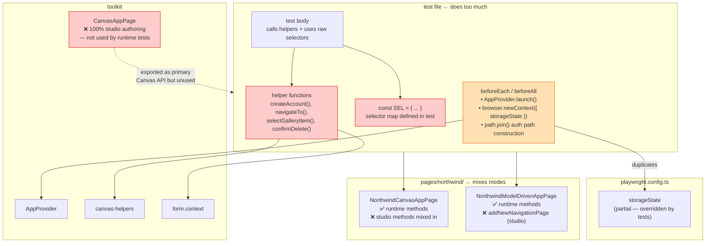
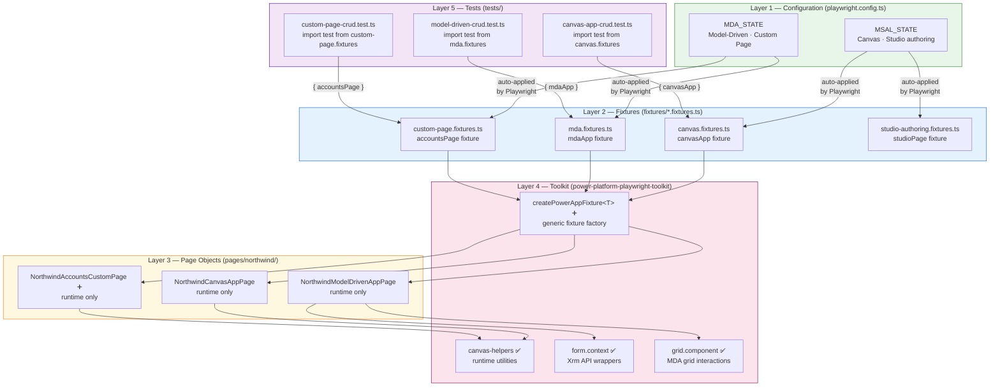
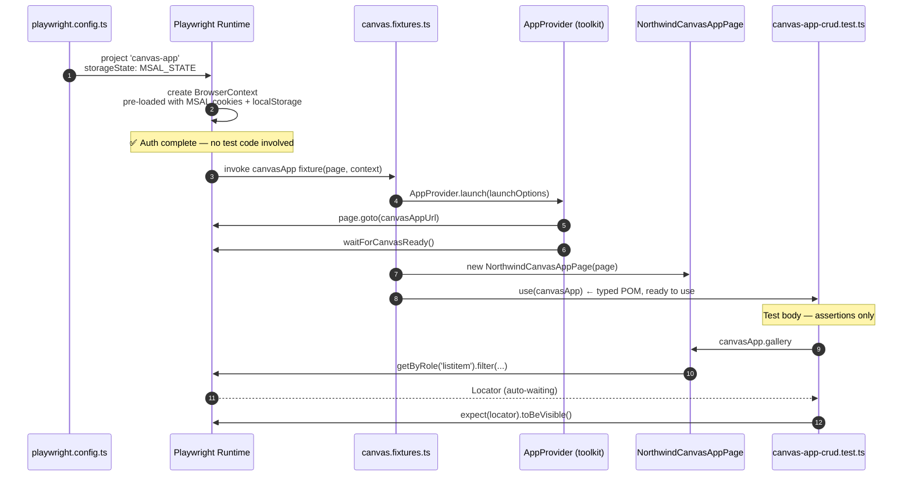
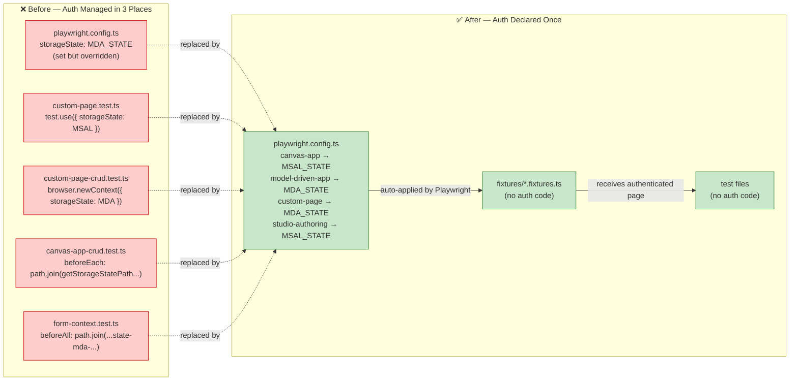

# Power Platform Playwright Toolkit — Gap Analysis

## Purpose

This document identifies gaps between the current state of the toolkit and test suite and the
stated intent of the project: **runtime play-mode testing of published Power Platform apps**.
It describes each gap, quantifies its scope with tables, and maps it to the remediation applied
in this branch.

---

## Stated Intent

The toolkit is designed to let **customers** write Playwright tests against **published**
Canvas Apps, Model-Driven Apps, and Custom Pages running in **Play mode**.  
It is **not** designed to test Power Apps Studio authoring workflows.

> Studio authoring tests (creating apps, adding pages, selecting data sources, AI generation)
> depend on internal Studio DOM structure that is not a public contract and will break whenever
> the Studio UI changes for performance or modernisation reasons.

---

## Gap 1 — Test Scope: Studio Authoring Mixed With Runtime Tests

### Description

Two test files exercise Power Apps Studio authoring flows, not published-app runtime behaviour.
These tests launch the Maker Portal in **Edit mode**, interact with Studio UI elements (command
bars, dialogs, AI panels), and depend on internal selectors such as
`#add-new-page-in-command-bar`, `[class*="animatedCanvasContainerPreview"]`, and
`[data-control-name*="DeleteConfirmBtn"]` inside a Studio preview frame.

### Affected Files

| File                                                   | Mode              | What It Actually Tests                                                                      | Fits Runtime Category?    |
| ------------------------------------------------------ | ----------------- | ------------------------------------------------------------------------------------------- | ------------------------- |
| `tests/northwind/custom-page/custom-page.test.ts`      | **Edit (Studio)** | Creates a Custom Page in Modern App Designer, adds Accounts data source, tests preview CRUD | **No — Studio authoring** |
| `tests/gen-ux/basic-form/basic-form.test.ts`           | **Edit (Studio)** | AI page generation via "Describe a page", Code tab review, Preview tab submit, Publish      | **No — Studio authoring** |
| `tests/northwind/canvas/canvas-app-crud.test.ts`       | **Play**          | Gallery load, record selection, Add/Reload buttons                                          | Yes                       |
| `tests/northwind/mda/model-driven-crud.test.ts`        | **Play**          | Full CRUD via Xrm API + Dataverse                                                           | Yes                       |
| `tests/northwind/mda/model-driven-direct-url.test.ts`  | **Play**          | Direct-URL navigation patterns                                                              | Yes                       |
| `tests/northwind/mda/form-context.test.ts`             | **Play**          | Xrm formContext API surface                                                                 | Yes                       |
| `tests/northwind/custom-page/custom-page-crud.test.ts` | **Play**          | Custom Page gallery/form/delete via Dataverse API                                           | Yes                       |

### Remediation

Studio tests are moved to `tests/studio-authoring/` and registered under a separate
`studio-authoring` Playwright project. Runtime tests remain in their current directories.

---

## Gap 2 — Selector Stability: Internal DOM Contracts Exposed in Tests and POM

### Description

Several selectors used in tests and POM classes target internal DOM attributes that Power Platform
does not guarantee across releases. The platform only guarantees ARIA semantics and stable
public API surfaces (Xrm, Dataverse OData).

### Selector Classification Table

| Selector Pattern                            | Example                                                         | Stability        | Risk                                                              |
| ------------------------------------------- | --------------------------------------------------------------- | ---------------- | ----------------------------------------------------------------- |
| `[aria-label="..."]`                        | `button[aria-label="Save"]`                                     | **Stable**       | Standard ARIA — unlikely to change                                |
| `[role="..."]`                              | `[role="grid"]`, `[role="row"]`                                 | **Stable**       | ARIA standard                                                     |
| `input[placeholder="..."]`                  | `input[placeholder="Search"]`                                   | **Stable**       | Semantic HTML                                                     |
| `[data-testid="..."]`                       | `[data-testid="create-blank-canvas-app"]`                       | **Stable**       | Explicitly marked for tests                                       |
| Xrm API (`page.evaluate`)                   | `Xrm.Page.data.entity.attributes.get(name)`                     | **Very Stable**  | Microsoft public API                                              |
| Dataverse OData                             | `/api/data/v9.2/accounts`                                       | **Very Stable**  | OData v4 standard                                                 |
| `[data-control-name="..."]`                 | `[data-control-name="Gallery1"]`                                | **Fragile**      | Internal Canvas runtime ID — changes with app redesign            |
| `[data-automation-id="..."]`                | `[data-automation-id="canvas-area"]`                            | **Fragile**      | Internal Studio implementation detail                             |
| `[data-id="..."]`                           | `input[data-id="nwind_ordernumber.fieldControl-text-box-text"]` | **Fragile**      | Internal Dynamics field ID — tied to schema name and control type |
| `[class*="ms-*"]`                           | `[class*="ms-List-surface"]`                                    | **Very Fragile** | Fluent UI class names change across design system updates         |
| `[class*="animatedCanvasContainerPreview"]` | Studio preview frame                                            | **Very Fragile** | Studio-internal CSS class                                         |
| `#commandBar_preview`                       | Studio preview button                                           | **Fragile**      | Internal Studio element ID                                        |
| `#start-from-data-button`                   | Studio data source button                                       | **Fragile**      | Internal Studio element ID                                        |

### Occurrence Count by File

| File                                | Stable (`aria-label`, `role`, Xrm API)                     | Fragile (`data-control-name`, `data-id`, `data-automation-id`, `ms-*`) |
| ----------------------------------- | ---------------------------------------------------------- | ---------------------------------------------------------------------- |
| `canvas-app-crud.test.ts`           | 0                                                          | 6 (`data-control-name` × 5, `data-control-part` × 1)                   |
| `model-driven-crud.test.ts`         | 4 (`aria-label*="Save"`, `role="option"`, `role="dialog"`) | 4 (`data-id` × 4)                                                      |
| `model-driven-direct-url.test.ts`   | 2                                                          | 2 (`data-id` × 2)                                                      |
| `custom-page.test.ts` _(Studio)_    | 0                                                          | 10+ (Studio class names, internal IDs)                                 |
| `basic-form.test.ts` _(Studio)_     | 3 (via toolkit GenUxPage)                                  | Indirect via GenUxPage Studio selectors                                |
| `NorthwindCanvasAppPage.ts`         | 2                                                          | 10 (`data-control-name` × 5, internal Studio IDs × 5)                  |
| `NorthwindModelDrivenAppPage.ts`    | 6                                                          | 4 (`data-id` × 3, internal frame ID × 1)                               |
| `CustomPage.page.ts` _(Studio POM)_ | 2                                                          | 8 (Studio IDs, `class*` × 3)                                           |
| `custom-page-crud.test.ts`          | 4                                                          | 6 (`data-control-name` × 4, `data-control-part` × 2)                   |

### Remediation

- All selectors are moved from test files into POM classes (test files contain zero selectors).
- Fragile selectors that cannot be replaced are centralised in POM classes with explanatory
  comments so they are easy to update when the platform changes.
- `data-control-name` selectors for Canvas runtime controls are an **accepted limitation**:
  Canvas app controls have no ARIA labels by default. See Gap 5 for the mitigation strategy.

---

## Gap 3 — Test Code in Test Files (No POM Delegation)

### Description

Test files contain selector strings, helper functions, and business logic that belong in
Page Object Model classes. This violates the contract that **test files are orchestration-only**
and that all interaction details are encapsulated in POM classes. Customers reading the sample
tests cannot distinguish "what I should copy" from "implementation detail I must not copy".

### Violations by File

| File                              | Violation Type                            | Example                                                                                        |
| --------------------------------- | ----------------------------------------- | ---------------------------------------------------------------------------------------------- |
| `canvas-app-crud.test.ts`         | Selector map defined in test file         | `const selectors = { addButton: '[data-control-name="icon3"]', ... }`                          |
| `canvas-app-crud.test.ts`         | `FrameLocator` managed in test body       | `canvasFrame = page.frameLocator(selectors.canvasFrame)`                                       |
| `model-driven-crud.test.ts`       | Fragile locators inline in test           | `page.locator('input[data-id="nwind_ordernumber.fieldControl-text-box-text"]')`                |
| `model-driven-crud.test.ts`       | `page.waitForFunction` with Xrm polling   | Inline `Xrm?.Page?.data?.entity?.getIsDirty()` wait                                            |
| `model-driven-crud.test.ts`       | `page.evaluate` for delete                | Inline `Xrm.WebApi.deleteRecord(entityName, entityId)`                                         |
| `model-driven-direct-url.test.ts` | Inline locator for form verification      | `page.locator('[data-id="form-container"]')`                                                   |
| `model-driven-direct-url.test.ts` | Inline locator count for field check      | `page.locator('input[data-id]').count()`                                                       |
| `form-context.test.ts`            | Writable-record discovery in `beforeEach` | 20-line `page.evaluate` + loop inline in test                                                  |
| `custom-page-crud.test.ts`        | Selector map in test file                 | `const SEL = { newRecordButton: '[title="New record"]', ... }`                                 |
| `custom-page-crud.test.ts`        | Helper functions in test file             | `createAccount`, `updateAccount`, `selectGalleryItem`, `confirmDelete`, `navigateToCustomPage` |

### Remediation

All selector strings, helper functions, and `page.evaluate`/`page.waitForFunction` calls are
moved to the appropriate POM class. Test files contain only:

- `import` statements
- `test.describe` / `test.beforeEach` / `test` blocks
- `expect` assertions
- Calls to POM methods

---

## Gap 4 — POM Class Coverage: Studio and Runtime Methods Mixed

### Description

POM classes provided in `pages/northwind/` mix runtime Play-mode methods with Studio
Edit-mode methods in the same class. This violates single-responsibility and means customers
instantiating the POM for runtime testing are exposed to unrelated Studio API.

### Method Classification

#### `NorthwindCanvasAppPage.ts`

| Method                                        | Mode                     | Fits Runtime POM? |
| --------------------------------------------- | ------------------------ | ----------------- |
| `insertControlsBySearch(controlNames)`        | Studio                   | **No — remove**   |
| `editControlName(newControlName)`             | Studio                   | **No — remove**   |
| `verifyControlDisplayedOnCanvas(controlName)` | Studio                   | **No — remove**   |
| `setAppPage(page)`                            | Studio (new-tab pattern) | **No — remove**   |
| `getStudioFrame()`                            | Studio                   | **No — remove**   |
| `waitForCanvasAppToLoad()`                    | Runtime                  | Yes               |
| `navigateToOrdersGrid()`                      | Runtime                  | Yes               |
| `getGalleryItemCount()`                       | Runtime                  | Yes               |
| `openFirstOrderRecord()`                      | Runtime                  | Yes               |
| `clickAddButton()`                            | Runtime                  | Yes               |
| `clickSaveButton()`                           | Runtime                  | Yes               |
| `clickReloadButton()`                         | Runtime                  | Yes               |
| `isAddButtonVisible()`                        | Runtime                  | Yes               |
| `isReloadButtonVisible()`                     | Runtime                  | Yes               |
| `clickBackButton()`                           | Runtime                  | Yes               |

#### `NorthwindModelDrivenAppPage.ts`

| Method                             | Mode                  | Fits Runtime POM? |
| ---------------------------------- | --------------------- | ----------------- |
| `addNewNavigationPage(url, title)` | Studio (App Designer) | **No — remove**   |
| `navigateToOrdersGrid()`           | Runtime               | Yes               |
| `openFirstOrderRecord()`           | Runtime               | Yes               |
| `verifyOrderFormIsDisplayed()`     | Runtime               | Yes               |
| `clickCommandButton(buttonName)`   | Runtime               | Yes               |
| `clickRefreshButton()`             | Runtime               | Yes               |
| `closeRecordAndGoBack()`           | Runtime               | Yes               |

#### `CustomPage.page.ts`

| Method                                      | Mode           | Fits Runtime POM?    |
| ------------------------------------------- | -------------- | -------------------- |
| `createNewCustomPage(title?)`               | Studio         | **No — Studio only** |
| `verifyToAddDataSourceWithData(dataSource)` | Studio         | **No — Studio only** |
| `navigateToPreviewScreen()`                 | Studio         | **No — Studio only** |
| `addNewRecordInPreviewMode(accountName)`    | Studio preview | **No — Studio only** |
| `deleteRecordInPreviewMode(accountName)`    | Studio preview | **No — Studio only** |

`CustomPage.page.ts` is entirely Studio authoring — it supports `custom-page.test.ts` which
moves to the studio-authoring project. It is retained unchanged under `pages/northwind/` for
use by studio-authoring tests.

#### `ModelDrivenAppPage.ts` (toolkit)

The base toolkit class mixes ~30 runtime methods with ~25 designer/authoring methods
(`createBlankModelDrivenApp`, `addTableBasedPage`, `addDashboardPage`, `addNavigationGroup`,
`shareApp`, etc.). The designer methods exist for authoring scenarios; the runtime methods
are the public surface used by customer tests.

| Method Group               | Count | Mode    |
| -------------------------- | ----- | ------- |
| Navigation (runtime)       | 5     | Runtime |
| Grid operations (runtime)  | 3     | Runtime |
| Form operations (runtime)  | 4     | Runtime |
| App creation / Designer    | 12    | Studio  |
| Page management / Designer | 6     | Studio  |
| Navigation designer        | 3     | Studio  |
| Settings / share           | 5     | Studio  |
| App search and management  | 5     | Both    |

### Remediation

- Studio methods are removed from `NorthwindCanvasAppPage` and `NorthwindModelDrivenAppPage`.
- Missing runtime helpers are added to `NorthwindModelDrivenAppPage` (CRUD flow methods,
  writable-record discovery, attribute read/write helpers).
- A new `NorthwindAccountsCustomPage.ts` POM is created for runtime Accounts Custom Page CRUD.
- `ModelDrivenAppPage` in the toolkit retains designer methods (they are valuable for Studio
  authoring scenarios) but documentation is updated to clarify which methods target runtime
  vs designer.

---

## Gap 5 — Canvas App Selector Stability: Accepted Limitation

### Description

Canvas Apps render all controls with internal `data-control-name` attributes in runtime mode.
There are no ARIA labels on Canvas controls by default. The control name comes from the app
maker and can change whenever the app is redesigned.

This is a **platform limitation**, not a toolkit defect. No stable alternative exists for
locating Canvas controls other than their `data-control-name`.

### Mitigation Strategy

| Approach                           | Applied?            | Description                                                                                                                                                                        |
| ---------------------------------- | ------------------- | ---------------------------------------------------------------------------------------------------------------------------------------------------------------------------------- |
| Centralise selectors in POM        | **Yes**             | All `data-control-name` strings are defined once in the POM class, not scattered across tests                                                                                      |
| Document the fragility             | **Yes**             | POM file has a comment explaining why these selectors exist and what to do when names change                                                                                       |
| Parameterise control names         | **Partial**         | Selector constants are named by purpose (`addButton`, `saveButton`) not by internal ID                                                                                             |
| Add ARIA labels to Canvas controls | **Customer action** | App makers can add `AccessibilityLabel` properties to Canvas controls, which render as `aria-label`. Toolkit tests should use `aria-label` selectors when the app is instrumented. |

### Canvas App ARIA Instrumentation Recommendation

Customers are encouraged to add `AccessibilityLabel` properties to key Canvas controls:

| Control       | Current Selector                 | Recommended After Instrumentation |
| ------------- | -------------------------------- | --------------------------------- |
| Gallery       | `[data-control-name="Gallery1"]` | `[aria-label="Orders Gallery"]`   |
| Add button    | `[data-control-name="icon3"]`    | `[aria-label="Add order"]`        |
| Save button   | `[data-control-name="icon5"]`    | `[aria-label="Save order"]`       |
| Reload button | `[data-control-name="icon6"]`    | `[aria-label="Reload orders"]`    |

---

## Gap 6 — Coding Standards for Published Artifacts

### Description

As published samples, test and POM files are read by customers as reference implementations.
Several patterns do not meet the standard expected of production-quality samples.

### Violations

| Pattern                                                        | Violation                                                                    | Remediation                                                         |
| -------------------------------------------------------------- | ---------------------------------------------------------------------------- | ------------------------------------------------------------------- |
| `console.log('🧪 TEST: ...')` throughout tests                 | Emoji-heavy diagnostic logs obscure test intent; customers copy this pattern | Remove excessive `console.log` from test files                      |
| `error: any` in catch blocks                                   | Suppresses TypeScript's error-type safety                                    | Replace with `catch (error: unknown)` or typed errors               |
| `await page.waitForTimeout(N)` as primary wait                 | Arbitrary sleeps are flaky and slow                                          | Replace with `waitForURL`, `waitFor({ state })`, or Xrm API polling |
| Test logic (helper functions) inside test files                | Mixes orchestration and implementation                                       | Move all helpers to POM classes                                     |
| Inline selector strings in test bodies                         | Leaks implementation details into test files                                 | Move all selectors to POM class constants                           |
| `CanvasAppPage` imported but `NorthwindCanvasAppPage` not used | Unused import; customers see an inconsistent pattern                         | Remove unused import; use the Northwind-specific POM                |
| Long `test.describe` descriptions with log separators          | `═══════════════` banners add noise                                          | Remove; test names and reporters provide structure                  |
| `console.log` URL of launched app at module level              | Runs at import time, before any test                                         | Move inside `beforeEach` or remove                                  |

---

## Gap 7 — Playwright Project Configuration

### Description

The Playwright project configuration does not reflect the two categories of tests.

### Current Configuration vs Required Configuration

| Project            | Current `testDir`             | Issue                                                                                      |
| ------------------ | ----------------------------- | ------------------------------------------------------------------------------------------ |
| `model-driven-app` | `tests/northwind/mda`         | OK                                                                                         |
| `canvas-app`       | `tests/northwind/canvas`      | OK                                                                                         |
| `custom-page`      | `tests/northwind/custom-page` | Contains one Studio test (`custom-page.test.ts`) and one runtime test — auth states differ |
| `gen-ux`           | `tests/gen-ux`                | Studio authoring — should be `studio-authoring` project                                    |
| `default`          | `tests/` (all)                | Catches everything including studio tests unintentionally                                  |
| _(missing)_        | —                             | No dedicated `studio-authoring` project                                                    |

### Remediation

| Project                    | New `testDir`                 | Auth State                      |
| -------------------------- | ----------------------------- | ------------------------------- |
| `model-driven-app`         | `tests/northwind/mda`         | MDA cert-auth state             |
| `canvas-app`               | `tests/northwind/canvas`      | Standard MSAL state             |
| `custom-page`              | `tests/northwind/custom-page` | MDA cert-auth state (CRUD only) |
| `studio-authoring` _(new)_ | `tests/studio-authoring`      | Standard MSAL state             |
| `default`                  | `tests/`                      | Standard MSAL state             |

`gen-ux` project is removed; its test is now under `studio-authoring`.

---

---

## Gap 8 — Toolkit Canvas API: `CanvasAppPage` Is Entirely Studio Authoring

### Description

`packages/power-platform-playwright-toolkit/src/pages/canvas-app.page.ts` is the primary
Canvas API class exported by the toolkit. Despite the stated intent of supporting runtime
play-mode testing, **every single method in `CanvasAppPage` targets Power Apps Studio
(Edit mode)**, not a running Canvas app.

There is no toolkit class that encapsulates how to interact with a **published Canvas app**
in play mode. Customers looking for guidance on Canvas runtime testing have no POM to
model their own code on — only the Studio authoring class, which is the wrong pattern.

### Method Classification — `CanvasAppPage`

| Method                            | Studio or Runtime | What It Targets                                                                  |
| --------------------------------- | ----------------- | -------------------------------------------------------------------------------- |
| `createBlankCanvasApp(name)`      | **Studio**        | Maker Portal — creates a new app                                                 |
| `saveApp()`                       | **Studio**        | Studio save action (`Ctrl+S`)                                                    |
| `publishApp()`                    | **Studio**        | Studio publish dialog                                                            |
| `playApp()`                       | **Studio**        | Opens Studio preview (same tab)                                                  |
| `addControl(controlType)`         | **Studio**        | Insert panel → control drag                                                      |
| `addButton()`                     | **Studio**        | Insert button shortcut                                                           |
| `setControlProperty(name, value)` | **Studio**        | Properties panel                                                                 |
| `setFormula(property, formula)`   | **Studio**        | Formula bar                                                                      |
| `addDataSource(dataSourceName)`   | **Studio**        | Data panel                                                                       |
| `addScreen(screenName)`           | **Studio**        | Screen list                                                                      |
| `deleteScreen(screenName)`        | **Studio**        | Screen list right-click                                                          |
| `shareApp()`                      | **Studio**        | Share dialog                                                                     |
| `getControl(options)`             | **Ambiguous**     | Returns `[data-control-name]` locator — internal attribute, not an ARIA contract |

**Runtime methods: 0 of 13.**

The `getControl()` helper exposes `[data-control-name="${options.name}"]` as the primary
way to locate Canvas controls. This is an internal runtime attribute whose value equals
the app-maker-assigned control name — it changes whenever the maker renames a control.

### Expected Toolkit State

| Class                              | Should Exist?                     | Purpose                                                                                                            |
| ---------------------------------- | --------------------------------- | ------------------------------------------------------------------------------------------------------------------ |
| `CanvasAppPage` (current)          | Yes — but clearly labelled Studio | Studio authoring scenarios only                                                                                    |
| `CanvasAppRuntimePage` _(missing)_ | **Yes — gap**                     | Runtime play-mode interaction: iframe management, gallery navigation, button clicks using canvas-helpers utilities |

### Remediation (Plan)

1. Create `CanvasAppRuntimePage` in the toolkit with runtime-focused methods:
   - `waitForAppReady(readinessSelector)` — wraps `waitForCanvasReady`
   - `getCanvasFrame()` — returns the `frameLocator` for the Canvas iframe
   - `clickButton(label)` — clicks a Canvas button by its accessibility label where available
   - `scrollGalleryToItem(gallerySelector, itemLocator)` — wraps `scrollGalleryToItem`
   - `fillInput(locator, value)` — wraps `fillCanvasInput`
   - `confirmDialog(options)` — wraps `confirmCanvasDialog`
2. Document `CanvasAppPage` clearly as a Studio authoring utility, not a runtime testing utility.
3. Export `CanvasAppRuntimePage` as the primary Canvas class in `index.ts`.

---

## Gap 9 — Toolkit MDA API: `ModelDrivenAppPage` Mixes Runtime and Designer Methods

### Description

`packages/power-platform-playwright-toolkit/src/components/model-driven/model-driven-app.page.ts`
mixes roughly **15 runtime** methods with **25+ designer/authoring** methods in a single class.
Customers using the class for runtime testing see a confusing surface where studio
methods (`createBlankModelDrivenApp`, `addTableBasedPage`, `addDashboardPage`) appear
alongside runtime methods (`navigateToGridView`, `navigateToFormView`).

### Method Classification — `ModelDrivenAppPage`

| Method Group        | Methods                                                  | Mode        |
| ------------------- | -------------------------------------------------------- | ----------- |
| App creation        | `createBlankModelDrivenApp`, `createNewTable`            | **Studio**  |
| Page management     | `addTableBasedPage`, `addDashboardPage`, `addCustomPage` | **Studio**  |
| Navigation designer | `addNavigationGroup`, `addNavigationSubArea`, `addTable` | **Studio**  |
| Settings / share    | `openSettings`, `shareApp`                               | **Studio**  |
| App lifecycle       | `openAppForEdit`, `saveApp`                              | **Studio**  |
| App search          | `searchForApp`                                           | Both        |
| Runtime navigation  | `navigateToGridView`, `navigateToFormView`               | **Runtime** |
| Component access    | `.grid`, `.form`, `.commanding`                          | **Runtime** |
| Auth + launch       | via `AppProvider`                                        | Runtime     |

Approximately **25 Studio methods, 5 clearly runtime methods, 5 shared** — the class is
dominated by authoring concerns and the runtime surface is not visually distinct.

### Impact

Customers inheriting from `ModelDrivenAppPage` for their runtime POM gain unwanted Studio
methods in their POM's public API. The sample `NorthwindModelDrivenAppPage` extends it
and also adds a Studio method (`addNewNavigationPage`), following the wrong pattern.

### Remediation (Plan)

The class is not split (breaking change to existing API consumers) but is restructured with
clear region comments separating `// ─── Studio / App Designer methods ───` from
`// ─── Runtime / Play-mode methods ───`. The toolkit's README and JSDoc blocks are updated
to state which methods are for which mode. A future major version can split to
`ModelDrivenAppDesignerPage` and `ModelDrivenAppRuntimePage`.

The sample `NorthwindModelDrivenAppPage` is updated to:

- Not extend `ModelDrivenAppPage` with Studio methods
- Only expose and use runtime methods

---

## Gap 10 — Toolkit Canvas Locators: No Runtime Play-Mode Section

### Description

`packages/power-platform-playwright-toolkit/src/locators/canvas-app.locators.ts` contains
two sections: **Home** (Maker Portal navigation) and **Studio** (Studio editor DOM).
There is **no Runtime section** — no locator constants for interacting with a published
Canvas app running in play mode.

### Current Locator Sections and Stability

| Section                            | Selector Examples                                                            | Stability                                       | Mode                      |
| ---------------------------------- | ---------------------------------------------------------------------------- | ----------------------------------------------- | ------------------------- |
| `Home`                             | `a[role="menuitem"][name="Apps"]`, `[data-testid="create-blank-canvas-app"]` | Stable                                          | Navigation / Maker Portal |
| `Studio.canvasArea`                | `[data-automation-id="canvas-area"]`                                         | **Fragile** — internal Studio attribute         | Studio authoring          |
| `Studio.selectedControl`           | `[data-is-selected="true"]`                                                  | **Fragile** — internal Studio state attribute   | Studio authoring          |
| `Studio.insertButton(controlType)` | `div[data-control-type="${controlType}"]`                                    | **Fragile** — internal Studio attribute         | Studio authoring          |
| `Studio.getControlByName(name)`    | `[data-control-name="${name}"]`                                              | **Fragile** — internal Canvas runtime attribute | Studio canvas             |
| _(missing)_ `Runtime`              | —                                                                            | —                                               | **Not present**           |

### What a Runtime Section Should Contain

Canvas runtime locators cannot be fully stable (see Gap 5), but they should be centralised:

| Locator            | Selector                                                                 | Notes                                           |
| ------------------ | ------------------------------------------------------------------------ | ----------------------------------------------- |
| Canvas iframe      | `iframe[allow*="cross-origin"]` (or `iframe[src*="apps.powerapps.com"]`) | Frame boundary for `frameLocator()`             |
| Gallery root       | `[data-control-name="${galleryName}"]` — fragile, parameterised          | Accepted limitation                             |
| Gallery item       | `[role="listitem"][data-control-part="gallery-item"]`                    | More stable — uses ARIA role                    |
| Gallery item title | `[data-control-name="${titleControl}"]` — parameterised                  | Accepted limitation                             |
| Canvas button      | `[data-control-name="${buttonName}"] [role="button"]`                    | Acceptable — role-based child                   |
| Canvas input       | `input[aria-label="${label}"]`                                           | Stable when app maker sets `AccessibilityLabel` |

### Remediation (Plan)

Add a `Runtime` section to `CanvasAppLocators` with parameterised, purpose-named locator
helpers for common runtime patterns. Document the fragility rationale alongside each
fragile selector so customers understand which ones to replace with ARIA labels.

---

## Gap 11 — Toolkit Exported API Surface: Studio Classes as Primary Entry Points

### Description

`packages/power-platform-playwright-toolkit/src/index.ts` exports `CanvasAppPage` and
`GenUxPage` as top-level named exports alongside the runtime-focused classes.

### Current Export Analysis

| Export                           | Type                                   | Mode            | Customer Impact                                  |
| -------------------------------- | -------------------------------------- | --------------- | ------------------------------------------------ |
| `AppProvider`                    | Core launch utility                    | Both            | Correct — neutral entry point                    |
| `CanvasAppPage`                  | Studio authoring class                 | **Studio only** | Misleading — customers expect runtime Canvas API |
| `ModelDrivenAppPage`             | Mixed                                  | Both            | Acceptable — but confusing (see Gap 9)           |
| `GenUxPage`                      | Studio AI generation                   | **Studio only** | Acceptable if clearly labelled                   |
| `getCanvasControlByName`         | Returns `[data-control-name]` locator  | **Fragile**     | Propagates the fragile selector pattern          |
| `getModelDrivenDataAutomationId` | Returns `[data-automation-id]` locator | **Fragile**     | Propagates internal Studio selector pattern      |
| `fillCanvasInput`                | Canvas input helper                    | **Runtime**     | Correct                                          |
| `clickCanvasButton`              | Canvas button helper                   | **Runtime**     | Correct                                          |
| `scrollGalleryToItem`            | Gallery scroll helper                  | **Runtime**     | Correct                                          |
| `waitForCanvasReady`             | Canvas init helper                     | **Runtime**     | Correct                                          |
| `confirmCanvasDialog`            | Canvas dialog helper                   | **Runtime**     | Correct                                          |
| `getFormContext`                 | Xrm context helper                     | **Runtime**     | Correct                                          |
| `getEntityAttribute`             | Xrm read helper                        | **Runtime**     | Correct                                          |
| `setEntityAttribute`             | Xrm write helper                       | **Runtime**     | Correct                                          |
| `saveForm`                       | Xrm save helper                        | **Runtime**     | Correct                                          |
| `isFormDirty`                    | Xrm state helper                       | **Runtime**     | Correct                                          |
| `executeInFormContext`           | Xrm execute helper                     | **Runtime**     | Correct                                          |

### Key Problem

`getCanvasControlByName` is a convenience helper that returns `page.locator('[data-control-name="${name}"]')`.
Exporting this function encourages customers to use `data-control-name` throughout their test code,
spreading the fragile internal attribute into customer codebases.

`getModelDrivenDataAutomationId` similarly returns `[data-automation-id]` — a Studio-internal attribute
not meant for customer test code.

### Remediation (Plan)

| Action                                     | Detail                                                                                          |
| ------------------------------------------ | ----------------------------------------------------------------------------------------------- |
| Add `CanvasAppRuntimePage` to exports      | Primary Canvas runtime class (Gap 8 deliverable)                                                |
| Deprecate `getCanvasControlByName`         | Mark with `@deprecated` — direct users to use `aria-label` selectors or centralise in their POM |
| Deprecate `getModelDrivenDataAutomationId` | Mark with `@deprecated` — Studio-internal, not for customer use                                 |
| Document `CanvasAppPage` as Studio-only    | Add `@remarks` JSDoc block; update README                                                       |
| Document `GenUxPage` as Studio-only        | Add `@remarks` JSDoc block                                                                      |

---

## Gap 12 — Toolkit Strengths: Well-Designed Runtime Components (Baseline)

### Description

The following toolkit components are correctly designed for runtime play-mode testing and
should serve as the design baseline for new code.

### Well-Designed Runtime Components

| File                                        | What It Does Right                                                                                                                                                                                                                                                                                                                                                                                                                                                                                                                |
| ------------------------------------------- | --------------------------------------------------------------------------------------------------------------------------------------------------------------------------------------------------------------------------------------------------------------------------------------------------------------------------------------------------------------------------------------------------------------------------------------------------------------------------------------------------------------------------------- |
| `utils/canvas-helpers.ts`                   | Pure runtime utilities. `clickCanvasButton` handles Canvas overlay intercept with force-click fallback. `scrollGalleryToItem` handles gallery virtualisation with wheel-event scroll. `fillCanvasInput` correctly uses `page.keyboard.type` to fire global DOM events that Canvas's Power Fx `OnChange` listens to — `fill()` and `pressSequentially()` do not trigger `OnChange`. `waitForCanvasReady` waits on a DOM signal, not a timeout. All helpers are composable functions, not class methods — easy to import and chain. |
| `components/model-driven/form.context.ts`   | All Xrm API wrappers. Uses `page.evaluate` (one-shot) not `waitForFunction` for Xrm collection enumeration — correctly documented workaround for D365 v9.2+ Xrm Collection API. `waitForEntityAttributes` uses polling via repeated `page.evaluate` calls, not `waitForFunction`. Handles inactive records gracefully.                                                                                                                                                                                                            |
| `components/model-driven/form.component.ts` | OOP wrapper around `form.context.ts`. Clean delegation with no duplicated logic. `navigateToTab`, `navigateToSection`, `showNotification` are runtime-only MDA interactions.                                                                                                                                                                                                                                                                                                                                                      |
| `components/model-driven/grid.component.ts` | Multi-strategy row interaction (link click → double-click fallback). `getRowCount` uses `[role="row"][row-index]` to count only data rows (not header rows). `waitForGridLoad` waits on DOM signal.                                                                                                                                                                                                                                                                                                                               |
| `components/gen-ux/gen-ux.page.ts`          | Well-written Studio class. `addNewPage` uses `findWithFallback` across multiple Studio version IDs — defensive and forward-compatible. `deleteAppsMatchingPrefix` includes cleanup utility.                                                                                                                                                                                                                                                                                                                                       |

### Design Patterns from These Files to Apply Everywhere

| Pattern                                             | Source                                   | Application                                               |
| --------------------------------------------------- | ---------------------------------------- | --------------------------------------------------------- |
| Wait on DOM signals, never `waitForTimeout`         | `canvas-helpers.ts`, `grid.component.ts` | Apply in all runtime POM waits                            |
| `page.evaluate` for Xrm, not `waitForFunction`      | `form.context.ts`                        | Apply in all MDA attribute interactions                   |
| Force-click fallback for Canvas overlay elements    | `clickCanvasButton`                      | Apply in all Canvas button clicks                         |
| Wheel-event scroll for virtualised galleries        | `scrollGalleryToItem`                    | Apply in all Canvas gallery navigation                    |
| `findWithFallback` for version-varying selectors    | `gen-ux.page.ts`                         | Apply in any selector that changes across Studio versions |
| `page.keyboard.type` not `fill()` for Canvas inputs | `fillCanvasInput`                        | Apply in all Canvas text input interactions               |

---

## Gap 13 — Playwright Best Practices: Built-In Locator Methods Not Used

### Description

Playwright 1.20+ introduced a set of **semantic locator methods** (`getByRole`, `getByLabel`,
`getByText`, etc.) as the officially recommended approach to element selection. These methods
match elements the way users perceive them — by ARIA role, accessible name, label text, or
visible text — rather than by internal DOM attributes. The entire codebase (toolkit and tests)
uses raw CSS selectors, bypassing Playwright's more resilient built-in API.

### Why This Matters

| Property                  | CSS Selectors (current)                                                         | Built-In Locators (recommended)                                               |
| ------------------------- | ------------------------------------------------------------------------------- | ----------------------------------------------------------------------------- |
| Breaks on DOM restructure | Yes — `[data-id="x.fieldControl-text-box-text"]` breaks if control type changes | No — `getByRole('textbox', { name: 'Order Number' })` survives layout changes |
| Auto-waits built in       | Only `locator.waitFor()` — requires explicit call                               | Yes — all built-in locators auto-wait before acting                           |
| Matches user intent       | No — matches internal attribute                                                 | Yes — matches the ARIA name or label the user sees                            |
| Readable at a glance      | No — `input[data-id="nwind_ordernumber.fieldControl-text-box-text"]`            | Yes — `getByLabel('Order Number')`                                            |
| Accessibility alignment   | None                                                                            | Enforces that controls are properly labelled                                  |

### Built-In Locator API Reference

| Method                       | When to Use                                                       | Example                                                |
| ---------------------------- | ----------------------------------------------------------------- | ------------------------------------------------------ |
| `getByRole(role, { name })`  | Buttons, links, rows, dialogs, grids — anything with an ARIA role | `page.getByRole('button', { name: 'Save' })`           |
| `getByLabel(text)`           | Form fields — matches the associated `<label>` or `aria-label`    | `page.getByLabel('Order Number')`                      |
| `getByPlaceholder(text)`     | Inputs with a visible placeholder                                 | `page.getByPlaceholder('Search accounts')`             |
| `getByText(text, { exact })` | Content elements — headings, list items, paragraphs               | `page.getByText('Northwind Traders', { exact: true })` |
| `getByTitle(text)`           | Elements with a `title` attribute (tooltip text)                  | `page.getByTitle('New record')`                        |
| `getByTestId(id)`            | Elements with `data-testid` (or configured test attribute)        | `page.getByTestId('submit-order')`                     |
| `getByAltText(text)`         | Images                                                            | `page.getByAltText('Company logo')`                    |

### Locator Composition and Filtering

```typescript
// Scope a search to within a parent element
page.getByRole('dialog').getByRole('button', { name: 'Confirm' });

// Filter a locator set by contained text or child element
page.getByRole('listitem').filter({ hasText: accountName });
page.getByRole('listitem').filter({ has: page.getByText(accountName, { exact: true }) });

// Positional selection
page.getByRole('row').first();
page.getByRole('row').nth(2);
```

### Current vs Recommended — Conversion Examples

| Current (fragile CSS)                                                           | Recommended (built-in locator)                                                                   | Notes                                                                                          |
| ------------------------------------------------------------------------------- | ------------------------------------------------------------------------------------------------ | ---------------------------------------------------------------------------------------------- |
| `page.locator('input[data-id="nwind_ordernumber.fieldControl-text-box-text"]')` | `page.getByLabel('Order Number')`                                                                | Requires field label to be set; falls back to `getByRole('textbox', { name: 'Order Number' })` |
| `page.locator('[aria-label="Save"]')`                                           | `page.getByRole('button', { name: 'Save' })`                                                     | Role narrows the match                                                                         |
| `page.locator('[role="row"][row-index]')`                                       | `page.getByRole('row').filter({ has: page.locator('[row-index]') })`                             | Preserves data-row-only filter                                                                 |
| `page.locator('[role="listitem"][data-control-part="gallery-item"]')`           | `page.getByRole('listitem').filter({ has: page.locator('[data-control-part="gallery-item"]') })` | Role-first, attribute filter                                                                   |
| `page.locator('[role="menuitem"]').first()`                                     | `page.getByRole('menuitem').first()`                                                             | Direct conversion                                                                              |
| `page.locator('input[aria-label="Account Name"]')`                              | `page.getByLabel('Account Name')`                                                                | Clean semantic match                                                                           |
| `page.locator('[title="New record"]')`                                          | `page.getByTitle('New record')`                                                                  | Direct conversion                                                                              |
| `page.locator('[role="button"]')` inside locator                                | `.getByRole('button')` chained on parent locator                                                 | Scoped search                                                                                  |

### Remediation (Plan)

All toolkit components and sample POM classes are updated to prefer built-in locator methods.
Raw CSS selectors are retained only for Canvas `data-control-name` patterns (accepted limitation,
see Gap 5) and for cases where no ARIA-equivalent exists, with an explanatory comment in each case.

---

## Gap 14 — Flakiness: No Systematic Anti-Flakiness Strategy

### Description

The current test suite relies on explicit `waitForTimeout` calls and manual polling loops for
timing, rather than Playwright's built-in reliability mechanisms. This produces tests that are
both slower (fixed sleeps over-wait) and less reliable (fixed sleeps under-wait on slow machines
or slow network). There is no project-level retry policy, no assertion timeout configuration,
and no use of network-level wait signals for asynchronous operations.

### Current Anti-Patterns and Their Replacements

| Anti-Pattern                                                       | Where                                     | Risk                                                                     | Replacement                                                                                                             |
| ------------------------------------------------------------------ | ----------------------------------------- | ------------------------------------------------------------------------ | ----------------------------------------------------------------------------------------------------------------------- |
| `await page.waitForTimeout(N)` as primary wait                     | All test files, multiple POMs             | Fixed sleep: too long on fast machines, too short on slow ones           | Replace with `locator.waitFor({ state })`, `page.waitForURL()`, or `expect(locator).toBeVisible()`                      |
| `locator.isVisible({ timeout: 500 }).catch(() => false)` in a loop | `canvas-helpers.ts` `scrollGalleryToItem` | Silent catch hides real errors; 500 ms timeout makes scroll loops slow   | Replace with `locator.isVisible()` — no timeout needed; auto-waiting is not needed in a polling check                   |
| Manual retry loop (`for (let attempt = 0; ...)`)                   | `retryAction` in `canvas-helpers.ts`      | Reinvents what `expect` retry already does                               | Use `expect(locator).toBeVisible()` with appropriate timeout for visibility waits; use `test.retry` for full test retry |
| `page.waitForTimeout(2000)` after form save                        | `form-context.test.ts`                    | Arbitrary — no signal that save completed                                | Replace with `expect(page).not.toHaveURL(/unsaved/)` or `waitForResponse` matching Dataverse API                        |
| Inline `page.waitForFunction` for Xrm polling                      | `model-driven-crud.test.ts`               | `waitForFunction` has a documented bug with arg placement (CLAUDE.md §1) | Use `waitForEntityAttributes` helper which polls via `page.evaluate`                                                    |
| `await page.waitForTimeout(3000)` after grid navigation            | `form-context.test.ts` `beforeEach`       | Races with grid data load                                                | Replace with `expect(page.getByRole('row').first()).toBeVisible()`                                                      |

### Playwright Reliability Features to Adopt

#### 1. Auto-Waiting (built in — already available, just not relied upon)

Every Playwright locator action (`click`, `fill`, `check`) and every `expect` assertion
auto-waits for the element to be in the correct state before acting. No `waitFor` call is needed:

```typescript
// CURRENT — explicit wait before click
await page.locator(SEL.btnDelete).waitFor({ state: 'visible', timeout: 10000 });
await page.locator(SEL.btnDelete).click();

// RECOMMENDED — auto-waiting handles this
await page.getByRole('button', { name: 'Delete' }).click();
```

#### 2. Assertion-Level Retry

`expect(locator).toBeVisible({ timeout })` retries the check until the element appears or
the timeout expires. This replaces manual `waitFor` + `expect` pairs:

```typescript
// CURRENT — two steps
await page.locator(SEL.galleryItem).first().waitFor({ state: 'visible', timeout: 15000 });
await expect(page.locator(SEL.galleryItem).first()).toBeVisible();

// RECOMMENDED — one step with retry built in
await expect(page.getByRole('listitem', { name: accountName })).toBeVisible({ timeout: 15000 });
```

#### 3. Global Assertion Timeout Configuration

Set a project-level assertion timeout in `playwright.config.ts` so every `expect` call has a
consistent retry budget without specifying it on each assertion:

```typescript
// playwright.config.ts
export default defineConfig({
  expect: { timeout: 15_000 }, // default assertion retry window
  timeout: 60_000, // default test timeout
  use: { actionTimeout: 10_000 }, // default per-action timeout
});
```

#### 4. Network-Level Wait After Dataverse Operations

After a Dataverse Web API call (create, update, delete), wait for the API response before
asserting UI state — not a fixed timeout:

```typescript
// RECOMMENDED — wait for the Dataverse response
const [response] = await Promise.all([
  page.waitForResponse(
    (resp) => resp.url().includes('/api/data/v9.2/accounts') && resp.status() === 204
  ),
  page.evaluate(async (name) => {
    /* fetch PATCH */
  }, accountName),
]);
expect(response.ok()).toBe(true);
```

#### 5. `page.waitForURL` After Navigation

```typescript
// CURRENT
await page.goto(url, { waitUntil: 'commit' });
await page.waitForTimeout(3000);

// RECOMMENDED
await page.goto(url, { waitUntil: 'commit' });
await page.waitForURL(/main\.aspx/, { timeout: 30_000 });
```

#### 6. Test-Level Retry for Known Flaky Tests

Canvas initialization and gallery load are genuinely non-deterministic across environments.
Playwright's `test.retry` handles full test reruns cleanly:

```typescript
// playwright.config.ts — per project
{
  name: 'canvas-app',
  retries: process.env.CI ? 2 : 0,   // 2 retries in CI, 0 locally for fast feedback
}
```

#### 7. `expect.soft()` for Non-Blocking Assertions

For diagnostic assertions that should not stop the test if they fail (e.g., checking both
Edit and Delete buttons are visible after selecting a record), use `expect.soft()`:

```typescript
await expect.soft(page.getByRole('button', { name: 'Edit' })).toBeVisible();
await expect.soft(page.getByRole('button', { name: 'Delete' })).toBeVisible();
// Test continues even if one soft assertion fails; all failures reported at end
```

### Flakiness Summary Table

| Strategy                                  | Configuration Location               | Applied To                  |
| ----------------------------------------- | ------------------------------------ | --------------------------- |
| Remove all `waitForTimeout`               | POM classes, test files              | Every explicit sleep        |
| `expect.configure({ timeout: 15000 })`    | `playwright.config.ts`               | All projects                |
| `use: { actionTimeout: 10000 }`           | `playwright.config.ts`               | All projects                |
| `retries: 2` in CI                        | `playwright.config.ts` per project   | `canvas-app`, `custom-page` |
| `page.waitForURL()` after navigation      | MDA navigation helpers               | All navigation steps        |
| `page.waitForResponse()` for API waits    | Dataverse helpers in custom-page POM | Create / update / delete    |
| `expect.soft()` for diagnostic assertions | Test files                           | Button-visibility checks    |
| Remove manual retry loops                 | `canvas-helpers.ts`                  | `retryAction`               |

---

## Architecture: Provider Pattern Design

### Motivation

The current architecture scatters three distinct concerns across every test file:

1. **Authentication** — storageState path construction appears in `beforeAll`, `test.use()`,
   and individual test logic, producing three different implementations of the same logic.
2. **App launch** — every test file manually creates an `AppProvider` and calls `.launch()`.
3. **Page Object creation** — every test file holds a `let appPage` variable populated in `beforeEach`.

This is 20–40 lines of boilerplate per test file, copied across five runtime tests and two studio
tests. When launch strategy or auth path changes, every test file must be updated.

The target design applies two Playwright best practices together:

- **`storageState` in `playwright.config.ts` (project level)** — declared once per project,
  flows automatically to every test. No test file, fixture, or `beforeEach` touches it.
- **Playwright Fixtures** — typed, composable setup functions that receive the pre-authenticated
  `page` and `context` from Playwright and return a ready-to-use Page Object.

---

### Architecture Diagrams

#### Diagram 1 — Current Architecture: Concerns Scattered Across Every Layer



#### Diagram 2 — Target Architecture: Clean, Layered Separation



#### Diagram 3 — Test Execution Sequence (Target Architecture)



#### Diagram 4 — Auth State Flow: Before vs After



---

### Principle 1 — `storageState` Is Declared Once, in `playwright.config.ts`

The existing `playwright.config.ts` already declares `storageState` per project. This is the
correct pattern and is kept. The problem is that test files then re-implement it:

| Location                                                  | Current State                                                                                | Target State                                                                          |
| --------------------------------------------------------- | -------------------------------------------------------------------------------------------- | ------------------------------------------------------------------------------------- |
| `playwright.config.ts` per project                        | ✅ Declares `storageState` — correct                                                         | ✅ Unchanged — single source of truth                                                 |
| `custom-page-crud.test.ts` `beforeAll`                    | ❌ `browser.newContext({ storageState })` — duplicates config                                | ❌ Remove entirely — fixture replaces `beforeAll`                                     |
| `custom-page.test.ts` `test.use({ storageState })`        | ❌ Overrides project config for MSAL — needed only because the project mixes two auth states | ❌ Remove — test moves to `studio-authoring` project which has the correct auth state |
| `form-context.test.ts`, `canvas-app-crud.test.ts`, others | Path construction in `beforeEach`                                                            | ❌ Remove — project config provides it                                                |

**The root cause of the auth mismatch** in `custom-page` is that the project currently contains
two tests with different auth needs:

- `custom-page-crud.test.ts` — runtime, needs MDA cert-auth state
- `custom-page.test.ts` — Studio authoring, needs MSAL state

Splitting into `custom-page` (runtime) and `studio-authoring` projects eliminates the mismatch
and all `test.use()` auth overrides with it.

#### Target `playwright.config.ts` Auth Configuration

```typescript
// playwright.config.ts — storageState declared once per project (no test file touches this)
const MSAL_STATE = process.env.MS_AUTH_EMAIL
  ? getStorageStatePath(process.env.MS_AUTH_EMAIL)
  : undefined;

const MDA_STATE = process.env.MS_AUTH_EMAIL
  ? path.join(
      path.dirname(getStorageStatePath(process.env.MS_AUTH_EMAIL)),
      `state-mda-${process.env.MS_AUTH_EMAIL}.json`
    )
  : undefined;

projects: [
  { name: 'canvas-app', use: { storageState: MSAL_STATE } }, // Canvas / Maker Portal
  { name: 'model-driven-app', use: { storageState: MDA_STATE } }, // Dynamics CRM domain
  { name: 'custom-page', use: { storageState: MDA_STATE } }, // Dynamics CRM domain
  { name: 'studio-authoring', use: { storageState: MSAL_STATE } }, // Maker Portal (moved tests)
];
```

When a test in `canvas-app` runs, Playwright creates a browser context pre-loaded with
`MSAL_STATE` before any test code executes. The fixture and the test both receive that
already-authenticated `page` — neither needs to know the state file path.

---

### Principle 2 — Fixtures Handle Launch + POM; Nothing Else

A fixture receives the already-authenticated `page` and `context` from Playwright and is
responsible for exactly two things: calling `AppProvider.launch()` and returning a typed POM.
It does not touch storageState, browser context creation, or auth paths.

```
playwright.config.ts
 └─ project: 'canvas-app'
     ├─ storageState: MSAL_STATE          ← auth applied automatically by Playwright
     └─ testDir: tests/northwind/canvas/
         └─ canvas-app-crud.test.ts
             └─ imports { test } from fixtures/canvas.fixtures.ts
                 └─ canvas.fixtures.ts
                     ├─ receives (page, context) — already authenticated
                     ├─ AppProvider.launch(launchOptions)
                     └─ returns NorthwindCanvasAppPage
```

#### Toolkit Contribution: `createPowerAppFixture<T>` ➕ Add

The toolkit exports a typed fixture factory. Customers use it to define their own
app-specific fixtures without writing Playwright `base.extend<T>()` boilerplate:

```typescript
// packages/power-platform-playwright-toolkit/src/fixtures/app-fixture.ts  [ADD]
import { test as base, Page, BrowserContext } from '@playwright/test';
import { AppProvider, AppLaunchOptions } from '../core/app-provider';

type PageObjectBuilder<T> = (page: Page, context: BrowserContext) => Promise<T>;

type FixtureDefinitions<T extends Record<string, unknown>> = {
  [K in keyof T]: { launchOptions: AppLaunchOptions; build: PageObjectBuilder<T[K]> };
};

/**
 * Creates a typed Playwright test object where each fixture key resolves to a
 * pre-launched, ready-to-use Page Object. Authentication is handled by
 * playwright.config.ts (storageState per project) — this factory only wraps
 * AppProvider.launch() and the POM constructor.
 */
export function createPowerAppFixture<T extends Record<string, unknown>>(
  definitions: FixtureDefinitions<T>
) {
  return base.extend<T>(
    Object.fromEntries(
      Object.entries(definitions).map(([key, def]) => [
        key,
        async (
          { page, context }: { page: Page; context: BrowserContext },
          use: (v: unknown) => Promise<void>
        ) => {
          const provider = new AppProvider(page, context);
          await provider.launch(def.launchOptions);
          await use(await def.build(page, context));
        },
      ])
    ) as Parameters<typeof base.extend<T>>[0]
  );
}
```

#### Sample Fixture Files ➕ Add (three files)

```typescript
// packages/e2e-tests/fixtures/mda.fixtures.ts
import { createPowerAppFixture, AppType, AppLaunchMode } from 'power-platform-playwright-toolkit';
import { NorthwindModelDrivenAppPage } from '../pages/northwind/NorthwindModelDrivenAppPage';

export const test = createPowerAppFixture<{ mdaApp: NorthwindModelDrivenAppPage }>({
  mdaApp: {
    launchOptions: {
      app: 'Northwind Orders',
      type: AppType.ModelDriven,
      mode: AppLaunchMode.Play,
      skipMakerPortal: true,
      directUrl: process.env.MODEL_DRIVEN_APP_URL!,
    },
    build: async (page) => new NorthwindModelDrivenAppPage(page),
  },
});

export { expect } from '@playwright/test';
// storageState: declared in playwright.config.ts 'model-driven-app' project — not here
```

```typescript
// packages/e2e-tests/fixtures/canvas.fixtures.ts
import { createPowerAppFixture, AppType, AppLaunchMode } from 'power-platform-playwright-toolkit';
import { NorthwindCanvasAppPage } from '../pages/northwind/NorthwindCanvasAppPage';

export const test = createPowerAppFixture<{ canvasApp: NorthwindCanvasAppPage }>({
  canvasApp: {
    launchOptions: {
      app: 'Northwind Orders',
      type: AppType.Canvas,
      mode: AppLaunchMode.Play,
      canvasAppId: process.env.CANVAS_APP_ID!,
      tenantId: process.env.CANVAS_APP_TENANT_ID!,
    },
    build: async (page) => new NorthwindCanvasAppPage(page),
  },
});

export { expect } from '@playwright/test';
// storageState: declared in playwright.config.ts 'canvas-app' project — not here
```

```typescript
// packages/e2e-tests/fixtures/custom-page.fixtures.ts
import { createPowerAppFixture, AppType, AppLaunchMode } from 'power-platform-playwright-toolkit';
import { NorthwindAccountsCustomPage } from '../pages/northwind/NorthwindAccountsCustomPage';

export const test = createPowerAppFixture<{ accountsPage: NorthwindAccountsCustomPage }>({
  accountsPage: {
    launchOptions: {
      app: 'Northwind Orders',
      type: AppType.ModelDriven,
      mode: AppLaunchMode.Play,
      skipMakerPortal: true,
      directUrl: process.env.MODEL_DRIVEN_APP_URL!,
    },
    build: async (page) => {
      const cp = new NorthwindAccountsCustomPage(page);
      await cp.navigateTo(); // navigate to AccountsCustomPage via sidebar
      return cp;
    },
  },
});

export { expect } from '@playwright/test';
// storageState: declared in playwright.config.ts 'custom-page' project — not here
```

---

### Before vs After: Test File Transformation

#### Canvas App (current vs target)

```typescript
// BEFORE — canvas-app-crud.test.ts
import { test, expect, Page, BrowserContext } from '@playwright/test';
import { AppProvider, AppType, AppLaunchMode, getStorageStatePath } from 'power-platform-playwright-toolkit';
import { NorthwindCanvasAppPage } from '../../pages/northwind/NorthwindCanvasAppPage';
import * as path from 'path';

const selectors = {                          // ← selector map in test file (Gap 3)
  canvasFrame: 'iframe[src*="apps.powerapps"]',
  gallery: '[data-control-name="Gallery1"]', // ← fragile selector (Gap 2)
  addButton: '[data-control-name="icon3"]',
};

test.describe('Canvas App CRUD', () => {
  let canvasApp: NorthwindCanvasAppPage;
  let canvasFrame: any;

  test.beforeEach(async ({ page, context }) => {           // ← 15 lines of boilerplate
    const storageStatePath = getStorageStatePath(process.env.MS_AUTH_EMAIL!);
    const appProvider = new AppProvider(page, context);
    await appProvider.launch({ ... });
    canvasApp = new NorthwindCanvasAppPage(page);
    await canvasApp.waitForAppReady();
    canvasFrame = page.frameLocator(selectors.canvasFrame); // ← frame managed in test
  });

  test('should display gallery on load', async ({ page }) => {
    const gallery = canvasFrame.locator(selectors.gallery); // ← selector used in test
    await expect(gallery).toBeVisible();
  });
});
```

```typescript
// AFTER — canvas-app-crud.test.ts
import { test, expect } from '../../fixtures/canvas.fixtures'; // ← one import

test.describe('Canvas App CRUD', () => {
  test('should display gallery on load', async ({ canvasApp }) => {
    await expect(canvasApp.gallery).toBeVisible(); // ← POM property, no selector
  });
});
// No beforeEach. No storageState. No AppProvider. No frame management. No selectors.
```

#### Custom Page (current vs target — also shows beforeAll removal)

```typescript
// BEFORE — custom-page-crud.test.ts
import * as path from 'path';
import { test, expect, Page, BrowserContext } from '@playwright/test';
import { AppProvider, AppType, AppLaunchMode, getStorageStatePath, ... } from 'power-platform-playwright-toolkit';

const SEL = {                                // ← selector map in test file (Gap 3)
  newRecordButton: '[title="New record"]',
  galleryItem: '[role="listitem"][data-control-part="gallery-item"]',
  // ... 10 more selectors
};

async function navigateToCustomPage(page: Page): Promise<void> { ... }   // ← helper in test
async function createAccount(page: Page, name: string): Promise<void> { ... }
async function selectGalleryItem(page: Page, name: string): Promise<void> { ... }

test.describe('Custom Page CRUD', () => {
  let sharedPage: Page;
  let sharedContext: BrowserContext;

  test.beforeAll(async ({ browser }) => {                  // ← manual context with storageState
    const storageStatePath = path.join(
      path.dirname(getStorageStatePath(process.env.MS_AUTH_EMAIL!)),
      `state-mda-${process.env.MS_AUTH_EMAIL}.json`
    );
    sharedContext = await browser.newContext({ storageState: storageStatePath });
    sharedPage = await sharedContext.newPage();
    const appProvider = new AppProvider(sharedPage, sharedContext);
    await appProvider.launch({ ... });
    await navigateToCustomPage(sharedPage);
  });

  test.afterAll(async () => { await sharedContext.close(); });

  test('should create an account', async () => {
    await createAccount(sharedPage, 'Acme Corp');          // ← helper defined in this file
    await expect(getGalleryItem(sharedPage, 'Acme Corp')).toBeVisible();
  });
});
```

```typescript
// AFTER — custom-page-crud.test.ts
import { test, expect } from '../../fixtures/custom-page.fixtures'; // ← one import

test.describe('Custom Page CRUD', () => {
  test('should create an account', async ({ accountsPage }) => {
    await accountsPage.createAccount('Acme Corp');
    await expect(accountsPage.getGalleryItem('Acme Corp')).toBeVisible();
  });
});
// storageState: from playwright.config.ts 'custom-page' project — MDA cert-auth applied automatically
// No beforeAll, no afterAll, no sharedPage, no sharedContext, no helper functions, no selectors.
```

**Test files import `test` and `expect` from their fixture file, not from `@playwright/test`.
Auth state is declared once in `playwright.config.ts` and never referenced in test or fixture code.**

### File-Level Inventory with Status

The legend applies to every row in the tables below:

| Symbol        | Meaning                                               |
| ------------- | ----------------------------------------------------- |
| ✅ **Keep**   | Exists and correctly designed — no changes needed     |
| 🔄 **Update** | Exists but needs modification                         |
| ➕ **Add**    | Does not exist — must be created                      |
| ❌ **Delete** | Exists but must be removed                            |
| 📦 **Move**   | Exists but must be relocated to a different directory |

#### Toolkit Package (`packages/power-platform-playwright-toolkit/src/`)

| File / Class                                            | Status        | Action Required                                                                                                                                         |
| ------------------------------------------------------- | ------------- | ------------------------------------------------------------------------------------------------------------------------------------------------------- |
| `utils/canvas-helpers.ts`                               | ✅ **Keep**   | Correct runtime utilities — design baseline                                                                                                             |
| `components/model-driven/form.context.ts`               | ✅ **Keep**   | Correct Xrm API wrappers                                                                                                                                |
| `components/model-driven/form.component.ts`             | ✅ **Keep**   | Correct OOP wrapper                                                                                                                                     |
| `components/gen-ux/gen-ux.page.ts`                      | ✅ **Keep**   | Well-written Studio class; label as Studio-authoring-only in JSDoc                                                                                      |
| `components/model-driven/grid.component.ts`             | 🔄 **Update** | Replace CSS selectors with `getByRole`; add `waitForURL` after navigation                                                                               |
| `pages/canvas-app.page.ts` (`CanvasAppPage`)            | 🔄 **Update** | Add `@remarks` JSDoc: "Studio authoring only"; move Studio exports to named group in index                                                              |
| `pages/model-driven-app.page.ts` (`ModelDrivenAppPage`) | 🔄 **Update** | Add `// ─── Studio methods ───` and `// ─── Runtime methods ───` region comments; add JSDoc per method group                                            |
| `locators/canvas-app.locators.ts`                       | 🔄 **Update** | Add `Runtime` section with Canvas iframe, gallery item, and button locator helpers                                                                      |
| `locators/model-driven-app.locators.ts`                 | 🔄 **Update** | Replace `data-automation-id` selectors with `getByRole` equivalents where possible                                                                      |
| `fixtures/app-fixture.ts`                               | ➕ **Add**    | New `createPowerAppFixture<T>` generic factory (see Architecture section)                                                                               |
| `index.ts`                                              | 🔄 **Update** | Export `createPowerAppFixture`; export `CanvasAppRuntimePage` when created; `@deprecated` `getCanvasControlByName` and `getModelDrivenDataAutomationId` |
| `CanvasAppRuntimePage` (new class)                      | ➕ **Add**    | New runtime Canvas page class wrapping `canvas-helpers.ts` utilities                                                                                    |
| `getCanvasControlByName` (exported helper)              | 🔄 **Update** | Mark `@deprecated` — propagates fragile `data-control-name` pattern                                                                                     |
| `getModelDrivenDataAutomationId` (exported helper)      | 🔄 **Update** | Mark `@deprecated` — propagates Studio-internal `data-automation-id` pattern                                                                            |

#### Sample POM Classes (`packages/e2e-tests/pages/northwind/`)

| File                             | Status        | Action Required                                                                                                                                                                                                |
| -------------------------------- | ------------- | -------------------------------------------------------------------------------------------------------------------------------------------------------------------------------------------------------------- |
| `NorthwindCanvasAppPage.ts`      | 🔄 **Update** | Remove 5 Studio methods (`insertControlsBySearch`, `editControlName`, `verifyControlDisplayedOnCanvas`, `setAppPage`, `getStudioFrame`); update remaining selectors to `getByRole`/`getByLabel` where possible |
| `NorthwindModelDrivenAppPage.ts` | 🔄 **Update** | Remove `addNewNavigationPage` (Studio); add CRUD helpers (`createOrder`, `deleteCurrentRecord`, `findWritableRecord`); replace CSS selectors with built-in locators                                            |
| `CustomPage.page.ts`             | ✅ **Keep**   | Studio authoring POM — correct for its purpose; no runtime use                                                                                                                                                 |
| `NorthwindAccountsCustomPage.ts` | ➕ **Add**    | New runtime POM for Accounts Custom Page CRUD: gallery navigation, Dataverse API helpers, confirm-delete dialog                                                                                                |

#### Fixture Files (`packages/e2e-tests/fixtures/`)

| File                                    | Status     | Action Required                                                                                     |
| --------------------------------------- | ---------- | --------------------------------------------------------------------------------------------------- |
| `fixtures/canvas.fixtures.ts`           | ➕ **Add** | Canvas app fixture: auth state, AppProvider launch, `NorthwindCanvasAppPage`                        |
| `fixtures/mda.fixtures.ts`              | ➕ **Add** | MDA fixture: MDA auth state, AppProvider launch, `NorthwindModelDrivenAppPage`                      |
| `fixtures/custom-page.fixtures.ts`      | ➕ **Add** | Custom Page fixture: MDA auth state, launch, navigate to custom page, `NorthwindAccountsCustomPage` |
| `fixtures/studio-authoring.fixtures.ts` | ➕ **Add** | Studio fixture: MSAL auth state, AppProvider in Edit mode, raw `Page` — no app-specific POM         |

#### Runtime Test Files (`packages/e2e-tests/tests/northwind/`)

| File                                   | Status        | Action Required                                                                                                                                                                                                                              |
| -------------------------------------- | ------------- | -------------------------------------------------------------------------------------------------------------------------------------------------------------------------------------------------------------------------------------------- |
| `canvas/canvas-app-crud.test.ts`       | 🔄 **Update** | Import `test`/`expect` from `canvas.fixtures`; remove `beforeEach` setup; use `canvasApp` fixture; replace all inline selectors with POM calls; remove `const selectors = {...}` map                                                         |
| `mda/model-driven-crud.test.ts`        | 🔄 **Update** | Import from `mda.fixtures`; remove `beforeEach`; replace inline `page.locator(data-id)`, inline `waitForFunction`, and inline `page.evaluate(Xrm.WebApi.deleteRecord)` with POM methods                                                      |
| `mda/model-driven-direct-url.test.ts`  | 🔄 **Update** | Import from `mda.fixtures`; replace inline `page.locator('[data-id="form-container"]')` with POM calls                                                                                                                                       |
| `mda/form-context.test.ts`             | 🔄 **Update** | Import from `mda.fixtures`; move 20-line writable-record discovery loop into `NorthwindModelDrivenAppPage.findWritableRecord()`; replace `waitForTimeout` with `waitForURL`                                                                  |
| `custom-page/custom-page-crud.test.ts` | 🔄 **Update** | Import from `custom-page.fixtures`; remove `const SEL = {...}` map; remove all helper functions (`createAccount`, `updateAccount`, `selectGalleryItem`, `confirmDelete`, `navigateToCustomPage`) — all move to `NorthwindAccountsCustomPage` |

#### Studio Authoring Test Files

| File                                   | Status      | Action Required                                                                                      |
| -------------------------------------- | ----------- | ---------------------------------------------------------------------------------------------------- |
| `custom-page/custom-page.test.ts`      | 📦 **Move** | Move to `tests/studio-authoring/custom-page-studio.test.ts`; import from `studio-authoring.fixtures` |
| `gen-ux/basic-form/basic-form.test.ts` | 📦 **Move** | Move to `tests/studio-authoring/gen-ux-basic-form.test.ts`; import from `studio-authoring.fixtures`  |

#### Configuration

| File                   | Status        | Action Required                                                                                                                                                                                                                                                    |
| ---------------------- | ------------- | ------------------------------------------------------------------------------------------------------------------------------------------------------------------------------------------------------------------------------------------------------------------ |
| `playwright.config.ts` | 🔄 **Update** | Add `studio-authoring` project (`tests/studio-authoring/`, MSAL auth state); remove `gen-ux` project; add `expect: { timeout: 15000 }`, `use: { actionTimeout: 10000 }` globally; add `retries: process.env.CI ? 2 : 0` to `canvas-app` and `custom-page` projects |
| `.env.example`         | ✅ **Keep**   | Complete — no changes required                                                                                                                                                                                                                                     |
| `tsconfig.json`        | ✅ **Keep**   | Path aliases correctly configured                                                                                                                                                                                                                                  |
| `rush.json`            | ✅ **Keep**   | Monorepo config correct                                                                                                                                                                                                                                            |

### Architecture Dependency Graph (Target State)

```
playwright.config.ts
 ├─ canvas-app project
 │   └─ canvas-app-crud.test.ts
 │       └─ fixtures/canvas.fixtures.ts
 │           ├─ createPowerAppFixture (toolkit)
 │           ├─ AppProvider.launch (toolkit)
 │           └─ NorthwindCanvasAppPage (e2e-tests/pages)
 │               ├─ canvas-helpers.ts (toolkit)        ← runtime utilities
 │               └─ CanvasAppLocators.Runtime (toolkit) ← runtime locators
 │
 ├─ model-driven-app project
 │   └─ *.test.ts
 │       └─ fixtures/mda.fixtures.ts
 │           ├─ createPowerAppFixture (toolkit)
 │           ├─ AppProvider.launch (toolkit)
 │           └─ NorthwindModelDrivenAppPage (e2e-tests/pages)
 │               ├─ form.context.ts (toolkit)           ← Xrm API wrappers
 │               ├─ form.component.ts (toolkit)         ← form interactions
 │               └─ grid.component.ts (toolkit)         ← grid interactions
 │
 ├─ custom-page project
 │   └─ custom-page-crud.test.ts
 │       └─ fixtures/custom-page.fixtures.ts
 │           ├─ createPowerAppFixture (toolkit)
 │           └─ NorthwindAccountsCustomPage (e2e-tests/pages)
 │               ├─ canvas-helpers.ts (toolkit)         ← gallery/button helpers
 │               └─ Dataverse Web API                   ← create/update helpers
 │
 └─ studio-authoring project
     └─ *.test.ts
         └─ fixtures/studio-authoring.fixtures.ts
             ├─ createPowerAppFixture (toolkit)
             ├─ CanvasAppPage (toolkit)                 ← Studio authoring class
             ├─ CustomPage.page.ts (e2e-tests/pages)    ← Studio POM
             └─ GenUxPage (toolkit)                     ← Studio AI generation
```

### Change Count Summary

| Package                                           | ✅ Keep | 🔄 Update       | ➕ Add      | ❌ Delete / 📦 Move |
| ------------------------------------------------- | ------- | --------------- | ----------- | ------------------- |
| **Toolkit** (`power-platform-playwright-toolkit`) | 3 files | 7 files/classes | 2 new files | 0                   |
| **Sample POMs** (`e2e-tests/pages/`)              | 1 file  | 2 files         | 1 new file  | 0                   |
| **Fixtures** (`e2e-tests/fixtures/`)              | —       | —               | 4 new files | 0                   |
| **Runtime Tests** (`e2e-tests/tests/northwind/`)  | 0       | 5 files         | 0           | 0                   |
| **Studio Tests**                                  | —       | —               | —           | 2 files moved       |
| **Config**                                        | 3 files | 1 file          | 0           | 0                   |
| **Total**                                         | **7**   | **15**          | **7**       | **2 moved**         |

---

## Summary of Changes Applied

| Category            | Change                                                                                      |
| ------------------- | ------------------------------------------------------------------------------------------- |
| **Docs**            | `gaps.md` created (this file)                                                               |
| **Tests moved**     | `custom-page.test.ts` → `tests/studio-authoring/custom-page-studio.test.ts`                 |
| **Tests moved**     | `gen-ux/basic-form/basic-form.test.ts` → `tests/studio-authoring/gen-ux-basic-form.test.ts` |
| **Config**          | `playwright.config.ts`: `gen-ux` project removed, `studio-authoring` project added          |
| **New POM**         | `pages/northwind/NorthwindAccountsCustomPage.ts` — runtime Accounts Custom Page CRUD        |
| **POM updated**     | `NorthwindCanvasAppPage.ts` — Studio methods removed, constructor simplified                |
| **POM updated**     | `NorthwindModelDrivenAppPage.ts` — Studio method removed, CRUD/form helpers added           |
| **Test refactored** | `canvas-app-crud.test.ts` — all interactions via `NorthwindCanvasAppPage` POM               |
| **Test refactored** | `model-driven-crud.test.ts` — all interactions via `NorthwindModelDrivenAppPage` POM        |
| **Test refactored** | `model-driven-direct-url.test.ts` — inline selectors moved to POM                           |
| **Test refactored** | `form-context.test.ts` — writable-record discovery moved to POM                             |
| **Test refactored** | `custom-page-crud.test.ts` — all interactions via `NorthwindAccountsCustomPage` POM         |
