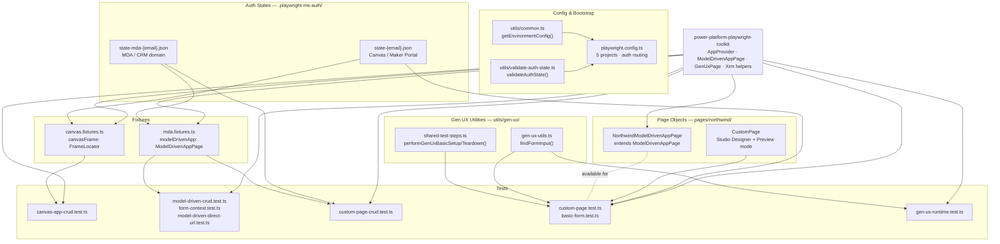
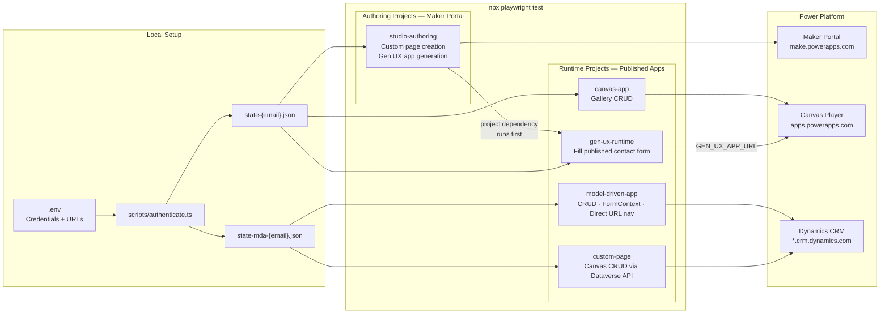

# Sample E2E Tests

Sample Playwright tests for Microsoft Power Platform applications, demonstrating how to use
`power-platform-playwright-toolkit` to test Canvas Apps, Model-Driven Apps, and Gen UX.

## Prerequisites

- Node.js 20+
- A Microsoft 365 tenant with Power Apps access
- [Northwind Traders solution](https://learn.microsoft.com/power-apps/maker/canvas-apps/northwind-install)
  installed in your environment (for Northwind tests)

## Setup

### 1. Install dependencies

From the repo root:

```bash
rush install
rush build
```

Or from this directory:

```bash
npm install
```

### 2. Configure environment

```bash
cp .envcopy .env
```

Edit `.env` with your values:

```bash
# Authentication
MS_AUTH_EMAIL=user@contoso.com

# Power Apps
POWER_APPS_BASE_URL=https://make.powerapps.com
POWER_APPS_ENVIRONMENT_ID=Default-00000000-0000-0000-0000-000000000000

# Canvas App (Option A: component IDs)
CANVAS_APP_ID=your-canvas-app-id
CANVAS_APP_TENANT_ID=your-tenant-id

# Canvas App (Option B: full play URL — takes precedence over IDs)
# CANVAS_APP_URL=https://apps.powerapps.com/play/e/<env-id>/a/<app-id>?tenantId=<tenant-id>

# Model-Driven App
MODEL_DRIVEN_APP_URL=https://your-org.crm.dynamics.com/main.aspx?appid=your-app-id

# Gen UX (optional — defaults to POWER_APPS_BASE_URL)
# MAKER_PORTAL_URL=https://make.preview.powerapps.com
```

### 3. Authenticate

**Canvas Apps and Maker Portal:**

```bash
npm run auth:headful
```

**Model-Driven Apps** (separate storage state for the Dynamics domain):

```bash
npm run auth:mda:headful
```

Authentication tokens are saved under `.playwright-ms-auth/`. Storage state is valid for **24 hours** — re-run authentication when tests fail with auth errors.

## Project Structure

```
e2e-tests/
├── globals/
│   ├── global-setup.ts          # Validates auth state before all tests
│   └── global-teardown.ts
├── fixtures/
│   ├── canvas.fixtures.ts       # canvasFrame fixture (Canvas runtime)
│   └── mda.fixtures.ts          # modelDrivenApp fixture (MDA runtime)
├── pages/northwind/
│   ├── NorthwindModelDrivenAppPage.ts # Custom POM for Northwind MDA (Edit mode)
│   └── CustomPage.page.ts            # Custom POM for Power Apps Studio custom page
├── tests/
│   ├── northwind/
│   │   ├── canvas/
│   │   │   └── canvas-app-crud.test.ts          # Canvas CRUD
│   │   ├── mda/
│   │   │   ├── model-driven-crud.test.ts         # MDA CRUD
│   │   │   ├── model-driven-direct-url.test.ts   # Direct URL navigation
│   │   │   └── form-context.test.ts              # FormContext API
│   │   └── custom-page/
│   │       ├── custom-page.test.ts               # Custom page authoring (Studio)
│   │       └── custom-page-crud.test.ts          # Custom page CRUD (Runtime)
│   └── gen-ux/
│       ├── basic-form/
│       │   └── basic-form.test.ts                # Gen UX form generation (Authoring)
│       └── runtime/
│           └── gen-ux-runtime.test.ts            # Fill published Gen UX form (Runtime)
├── utils/
│   ├── common.ts                # getEnvironmentConfig (used by playwright.config.ts)
│   └── validate-auth-state.ts   # Auth token validation
├── scripts/
│   └── authenticate.ts          # Auth script (--mda, --headful flags)
├── playwright.config.ts
└── .envcopy                     # Environment variable template
```

## Package Architecture

### Component Map

Shows the static relationships between every layer of the package — what each component is and what it imports.



### Test Execution Architecture

Shows how tests run at runtime — which auth state each project uses and which Power Platform endpoint it targets.



## Running Tests

```bash
# All tests
npx playwright test

# By project
npx playwright test --project=model-driven-app
npx playwright test --project=canvas-app
npx playwright test --project=custom-page
npx playwright test --project=studio-authoring
npx playwright test --project=gen-ux-runtime   # runs studio-authoring first (dependency)

# Specific file
npx playwright test tests/northwind/mda/model-driven-crud.test.ts

# With visible browser
npx playwright test --headed --project=mda

# Debug mode
npx playwright test --debug tests/northwind/mda/form-context.test.ts

# UI mode
npx playwright test --ui
```

## Test Architecture — Authoring vs Runtime

Tests in this repo fall into two categories:

| Category      | What it means                                                                                | Auth state needed                                            |
| ------------- | -------------------------------------------------------------------------------------------- | ------------------------------------------------------------ |
| **Runtime**   | Opens a _published_ app at a known URL and tests the user-facing experience                  | Canvas: `state-{email}.json` · MDA: `state-mda-{email}.json` |
| **Authoring** | Opens the app in _Edit / Studio mode_ in the Maker Portal and tests the authoring experience | Canvas: `state-{email}.json` (Maker Portal domain)           |

This split keeps fast, stable runtime tests separate from slower, more brittle authoring tests. Authoring tests require the Maker Portal to be available and may modify app structure, so they run under their own `studio-authoring` project.

### Full test inventory

| Test file                               | Mode          | Project            | Auth state | What it tests                             |
| --------------------------------------- | ------------- | ------------------ | ---------- | ----------------------------------------- |
| `canvas/canvas-app-crud.test.ts`        | **Runtime**   | `canvas-app`       | Canvas     | Gallery CRUD, toolbar buttons             |
| `mda/model-driven-crud.test.ts`         | **Runtime**   | `model-driven-app` | MDA        | Full CRUD workflow via Xrm API            |
| `mda/model-driven-direct-url.test.ts`   | **Runtime**   | `model-driven-app` | MDA        | Direct URL navigation patterns            |
| `mda/form-context.test.ts`              | **Runtime**   | `model-driven-app` | MDA        | Xrm FormContext read/write/save           |
| `custom-page/custom-page-crud.test.ts`  | **Runtime**   | `custom-page`      | MDA        | Canvas custom page CRUD via Dataverse API |
| `gen-ux/runtime/gen-ux-runtime.test.ts` | **Runtime**   | `gen-ux-runtime`   | Canvas     | Fill and submit the published Gen UX form |
| `custom-page/custom-page.test.ts`       | **Authoring** | `studio-authoring` | Canvas     | Create a custom page in App Designer      |
| `gen-ux/basic-form/basic-form.test.ts`  | **Authoring** | `studio-authoring` | Canvas     | Generate form with AI prompt, publish     |

### Gen UX — authoring then runtime

The gen-ux tests are split into two projects that run in order:

1. **`studio-authoring`** — opens the Maker Portal, generates a contact form app with an AI prompt, verifies the preview, and publishes it.
2. **`gen-ux-runtime`** — opens the _published_ app directly via `GEN_UX_APP_URL`, fills the contact form (First Name, Last Name, Email), and asserts a success message.

`gen-ux-runtime` declares `studio-authoring` as a [Playwright project dependency](https://playwright.dev/docs/test-projects#dependencies), so when you run the full suite, the authoring test always publishes the app before the runtime test opens it:

```bash
# Runs authoring first (publishes), then runtime (fills the published form)
npx playwright test --project=gen-ux-runtime
```

To enable the runtime test, set `GEN_UX_APP_URL` in `.env`:

```bash
# .env — copy the play URL from Maker Portal → Apps → Play
GEN_UX_APP_URL=https://apps.powerapps.com/play/e/<env-id>/a/<app-id>?tenantId=<tenant-id>
```

The runtime test skips automatically if `GEN_UX_APP_URL` is not set.

## Test Projects

Defined in `playwright.config.ts`:

| Project            | Tests matched                                       | Auth storage state       | Depends on         |
| ------------------ | --------------------------------------------------- | ------------------------ | ------------------ |
| `model-driven-app` | `tests/northwind/mda/**`                            | `state-mda-{email}.json` | —                  |
| `canvas-app`       | `tests/northwind/canvas/**`                         | `state-{email}.json`     | —                  |
| `custom-page`      | `**/custom-page-crud.test.ts`                       | `state-mda-{email}.json` | —                  |
| `studio-authoring` | `**/custom-page.test.ts`, `**/gen-ux/basic-form/**` | `state-{email}.json`     | —                  |
| `gen-ux-runtime`   | `**/gen-ux/runtime/**`                              | `state-{email}.json`     | `studio-authoring` |

## What the Tests Cover

### Model-Driven App (`tests/northwind/mda/`)

- **CRUD** — create, read, update, delete Northwind order records
- **Direct URL navigation** — `navigateToGridView`, `navigateToFormView` patterns
- **FormContext API** — read/write entity attributes, save form, check dirty/valid state
- **Custom Pages** — test pages embedded in Model-Driven Apps

### Canvas App (`tests/northwind/canvas/`)

- **CRUD** — create, read, update, delete orders in Northwind Canvas App
- Gallery interaction, form fill, iframe (`fullscreen-app-host`) scoping

### Gen UX (`tests/gen-ux/`)

- Generate a Canvas App from an AI prompt via the Maker Portal
- Verify generated form fields in the UCI Preview iframe
- Submit form and assert success

## Troubleshooting

| Problem                                                  | Fix                                                                          |
| -------------------------------------------------------- | ---------------------------------------------------------------------------- |
| Auth errors / token expired                              | Delete `state-*.json` and re-run `npm run auth:headful`                      |
| MDA tests fail auth                                      | Run `npm run auth:mda:headful`                                               |
| `MODEL_DRIVEN_APP_URL` not set                           | Set it in `.env`                                                             |
| Canvas app not loading                                   | Increase `timeout` in `playwright.config.ts`; Canvas apps take 5–10s to load |
| `Cannot find module 'power-platform-playwright-toolkit'` | Run `rush build` from repo root                                              |
| Gen UX tests slow / timeout                              | AI generation takes up to 120s — this is expected                            |

## Learn More

- [Setup Guide](https://microsoft.github.io/power-platform-playwright-samples/guide/setup)
- [Authentication Guide](https://microsoft.github.io/power-platform-playwright-samples/guide/authentication)
- [Model-Driven Apps Guide](https://microsoft.github.io/power-platform-playwright-samples/guide/model-driven-apps)
- [Canvas Apps Guide](https://microsoft.github.io/power-platform-playwright-samples/guide/canvas-apps)
- [Gen UX Guide](https://microsoft.github.io/power-platform-playwright-samples/guide/gen-ux)
