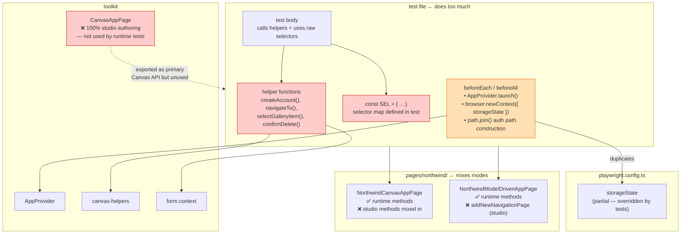
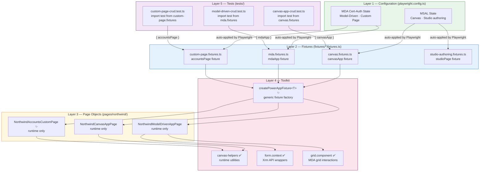
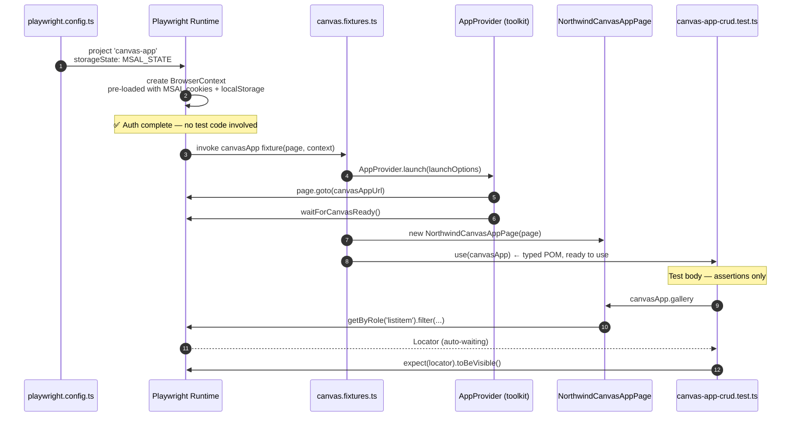
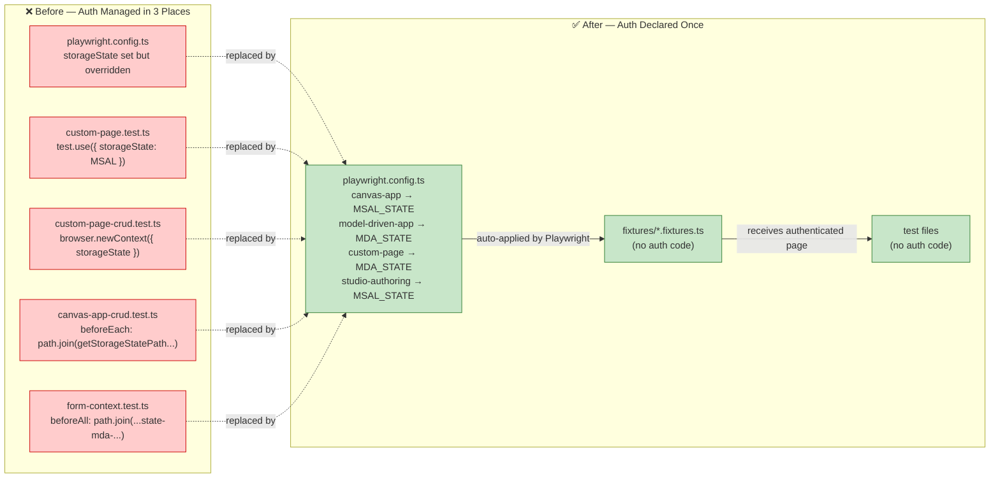

# Power Platform Playwright Toolkit

A TypeScript-native toolkit for testing **published Canvas Apps**, **Model-Driven Apps (MDA)**, and **Custom Pages** with Playwright. Implements the provider pattern, typed fixtures, runtime page objects, and Playwright best-practice locator utilities.

> **Scope:** This toolkit targets _published_ Power Platform apps running in **Play mode**. APIs that target Power Apps Studio (Edit mode) are explicitly labelled 🎨 Studio only. Do not use Studio APIs in runtime tests.

---

## Package Structure

```mermaid
block-beta
  columns 3

  block:Entry["Entry Point"]:3
    IDX["src/index.ts — all public exports"]
  end

  block:Core["Core"]:1
    AP["AppProvider\n(launch factory)"]
    FT["createPowerAppFixture&lt;T&gt;\n✨ typed fixture factory"]
    UB["URLBuilder"]
  end

  block:PagesBlk["Pages"]:1
    CARP["CanvasAppRuntimePage\n▶ Play mode ✨"]
    CAP["CanvasAppPage\n🎨 Studio only"]
    MDAP["ModelDrivenAppPage\n🔧 Studio + Runtime"]
  end

  block:CompBlk["Components"]:1
    GC["GridComponent\n▶ ag-Grid interactions"]
    FC["FormComponent\n▶ form operations"]
    CC["CommandingComponent\n▶ command bar"]
    GUX["GenUxPage\n🎨 Studio AI"]
  end

  block:LocBlk["Locators"]:1
    CAL["CanvasAppLocators\nHome · Studio · Runtime"]
    MDAL["ModelDrivenAppLocators\nDesigner · Runtime"]
  end

  block:UtilBlk["Utilities"]:1
    CH["canvas-helpers\n▶ click · fill · scroll"]
    FormCtx["form.context\n▶ Xrm API wrappers"]
    FL["findLocator()\n✨ built-in first → CSS fallback"]
  end

  block:AuthBlk["Auth"]:1
    MAH["MsAuthHelper"]
    CAR["addCertAuthRoute"]
  end

  IDX --> AP
  IDX --> FT
  IDX --> CARP
  IDX --> MDAP
  IDX --> GC
  IDX --> FL
  IDX --> MAH
```



---

## Architecture

### Current Architecture — Concerns Scattered Across Every Layer

Before the provider pattern, auth setup, selector management, and app-launch logic all lived inside individual test files. The diagram shows the problem: `beforeEach`/`beforeAll` blocks duplicate `storageState`, helper functions defined per-test file call into the toolkit directly, and `CanvasAppPage` is exported as the primary Canvas API but never used by runtime tests.



### Layered Architecture — Target State

Each layer has one responsibility. `storageState` is declared once in `playwright.config.ts`; no test or fixture touches it.



### Test Execution Sequence



### Auth State Flow: Before vs After



---

## Installation

```bash
npm install power-platform-playwright-toolkit @playwright/test
```

---

## Quick Start

### 1 — Declare auth once in `playwright.config.ts`

```typescript
// playwright.config.ts
const MSAL_STATE = process.env.MS_AUTH_EMAIL
  ? getStorageStatePath(process.env.MS_AUTH_EMAIL)
  : undefined;

const MDA_STATE = process.env.MS_AUTH_EMAIL
  ? path.join(
      path.dirname(getStorageStatePath(process.env.MS_AUTH_EMAIL)),
      `state-mda-${process.env.MS_AUTH_EMAIL}.json`
    )
  : undefined;

export default defineConfig({
  expect: { timeout: 15_000 },
  use: { actionTimeout: 10_000 },
  projects: [
    { name: 'canvas-app', use: { storageState: MSAL_STATE }, retries: process.env.CI ? 2 : 0 },
    { name: 'model-driven-app', use: { storageState: MDA_STATE } },
    { name: 'custom-page', use: { storageState: MDA_STATE }, retries: process.env.CI ? 2 : 0 },
    { name: 'studio-authoring', use: { storageState: MSAL_STATE } },
  ],
});
```

### 2 — Create a typed fixture

```typescript
// fixtures/mda.fixtures.ts
import { createPowerAppFixture, AppType, AppLaunchMode } from 'power-platform-playwright-toolkit';
import { NorthwindModelDrivenAppPage } from '../pages/NorthwindModelDrivenAppPage';

export const test = createPowerAppFixture<{ mdaApp: NorthwindModelDrivenAppPage }>({
  mdaApp: {
    launchOptions: {
      app: 'Northwind Orders',
      type: AppType.ModelDriven,
      mode: AppLaunchMode.Play,
      skipMakerPortal: true,
      directUrl: process.env.MODEL_DRIVEN_APP_URL!,
    },
    build: async (page) => new NorthwindModelDrivenAppPage(page),
  },
});

export { expect } from '@playwright/test';
// storageState is in playwright.config.ts — never set it here
```

```typescript
// fixtures/canvas.fixtures.ts
import { createPowerAppFixture, AppType, AppLaunchMode } from 'power-platform-playwright-toolkit';
import { NorthwindCanvasAppPage } from '../pages/NorthwindCanvasAppPage';

export const test = createPowerAppFixture<{ canvasApp: NorthwindCanvasAppPage }>({
  canvasApp: {
    launchOptions: {
      app: 'Northwind Orders',
      type: AppType.Canvas,
      mode: AppLaunchMode.Play,
      canvasAppId: process.env.CANVAS_APP_ID!,
      tenantId: process.env.CANVAS_APP_TENANT_ID!,
    },
    build: async (page) => new NorthwindCanvasAppPage(page),
  },
});

export { expect } from '@playwright/test';
```

### 3 — Write clean tests

```typescript
// tests/canvas-app-crud.test.ts
import { test, expect } from '../../fixtures/canvas.fixtures';

test.describe('Canvas App CRUD', () => {
  test('gallery loads on startup', async ({ canvasApp }) => {
    await expect(canvasApp.gallery).toBeVisible();
  });

  test('can add and reload a record', async ({ canvasApp }) => {
    await canvasApp.clickAddButton();
    await canvasApp.fillOrderName('Test Order');
    await canvasApp.clickSaveButton();
    await canvasApp.clickReloadButton();
    await expect(canvasApp.getGalleryItem('Test Order')).toBeVisible();
  });
});
// No beforeEach. No storageState. No AppProvider. No selectors. No frame management.
```

```typescript
// tests/model-driven-crud.test.ts
import { test, expect } from '../../fixtures/mda.fixtures';

test.describe('MDA CRUD', () => {
  test('create and delete an order', async ({ mdaApp }) => {
    const orderId = await mdaApp.createOrder({ orderName: 'TEST-001' });
    await expect(mdaApp.grid.getRowByText('TEST-001')).toBeVisible();
    await mdaApp.deleteOrder(orderId);
  });
});
```

### Canvas Runtime Page

For Play-mode Canvas testing, use `CanvasAppRuntimePage` (not `CanvasAppPage`):

```typescript
import { CanvasAppRuntimePage, CanvasAppLocators } from 'power-platform-playwright-toolkit';

// In a fixture or page class constructor:
const canvasApp = new CanvasAppRuntimePage(page);

// Get the cross-origin Canvas player iframe
// ⚠️ VERIFY: confirm the iframe src in your environment first:
//   page.locator('iframe').evaluateAll(els => els.map(e => e.src))
const frame = canvasApp.getCanvasFrame();

await canvasApp.waitForAppReady('[title="New record"]');
await canvasApp.clickButton(frame.locator('[data-control-name="SaveBtn"] [role="button"]'));
await canvasApp.fillInput(frame.locator('input[aria-label="Account Name"]'), 'Contoso');
```

### `findLocator` — Built-in Locators First, CSS Fallback

The toolkit's locator utility prefers Playwright's semantic built-in locators before falling back to CSS selectors:

```typescript
import { findLocator } from 'power-platform-playwright-toolkit';

// Put built-in specs first, CSS fallback last
const saveBtn = await findLocator(page, [
  { by: 'role', role: 'button', name: 'Save' }, // tried first
  { by: 'label', name: 'Save' }, // tried second
  { by: 'css', selector: 'button[aria-label="Save"]' }, // last resort
]);
await saveBtn.click();

// Works inside Canvas iframes too (accepts FrameLocator)
const frame = canvasApp.getCanvasFrame();
const btn = await findLocator(frame, [
  { by: 'role', role: 'button', name: 'Delete record' },
  { by: 'css', selector: '[data-control-name="DeleteBtn"] [role="button"]' },
]);
```

---

## Configuration

Configuration lives in `packages/e2e-tests/.env` — copy from [`packages/e2e-tests/.env.example`](../e2e-tests/.env.example) and fill in your values. The toolkit itself is a library with no `.env` file.

### Power Apps / Maker Portal

```env
POWER_APPS_BASE_URL=https://make.powerapps.com
POWER_APPS_DEFAULT_URL=/home
POWER_APPS_ENVIRONMENT_ID=your-environment-id-here
CANVAS_DESIGNER_URL=https://apps.powerapps.com/
```

### Microsoft Authentication

```env
MS_AUTH_EMAIL=your-email@domain.com

# Password authentication (simplest for local dev)
MS_AUTH_CREDENTIAL_TYPE=password
MS_AUTH_CREDENTIAL_PROVIDER=environment
MS_USER_PASSWORD=your-password-here

# Certificate authentication (recommended for CI/CD)
# MS_AUTH_CREDENTIAL_TYPE=certificate
# MS_AUTH_CREDENTIAL_PROVIDER=local-file
# MS_AUTH_LOCAL_FILE_PATH=./cert/your-cert.pfx
# MS_AUTH_CERTIFICATE_PASSWORD=your-cert-password

MS_AUTH_HEADLESS=true
MS_AUTH_TIMEOUT=60000
AUTH_ENDPOINT=https://login.microsoftonline.com
```

### Test Configuration

```env
HEADLESS=true
BROWSER=chromium
WORKERS=1
RETRIES=0
TIMEOUT=30000
```

### AI Reporter (optional)

```env
# Performance thresholds (seconds)
SLOW_TEST_THRESHOLD=3
TIMEOUT_WARNING_THRESHOLD=20

# Features — set true to enable
GENERATE_FIX=false
CREATE_BUG=false
GENERATE_PR=false

# OpenAI (for fix suggestions)
OPENAI_API_KEY=your-openai-api-key
OPENAI_MODEL=gpt-4

# Email notifications
SEND_EMAIL=false
EMAIL_SMTP_HOST=smtp.gmail.com
EMAIL_SMTP_PORT=587
EMAIL_FROM=no-reply@yourdomain.com
EMAIL_TO=team@yourdomain.com
```

---

## API Reference

### Core

| Export                     | Description                                                                                                             |
| -------------------------- | ----------------------------------------------------------------------------------------------------------------------- |
| `AppProvider`              | Launch factory — navigates to the app and returns control. Pass pre-authenticated `page` and `context` from Playwright. |
| `createPowerAppFixture<T>` | Typed fixture factory. Wraps `base.extend<T>()`. Auth is handled by `playwright.config.ts`.                             |
| `URLBuilder`               | URL construction helpers for MDA, Canvas, and Maker Portal.                                                             |

### Page Objects

| Export                 | Mode           | Description                                                                                                                                                                              |
| ---------------------- | -------------- | ---------------------------------------------------------------------------------------------------------------------------------------------------------------------------------------- |
| `CanvasAppRuntimePage` | ▶ Runtime      | Iframe management, gallery scroll, button/input helpers for a published Canvas app.                                                                                                      |
| `CanvasAppPage`        | 🎨 Studio only | Power Apps Studio authoring (create, save, publish, add controls). Do **not** use in runtime tests.                                                                                      |
| `ModelDrivenAppPage`   | 🔧 Mixed       | MDA navigation (`navigateToGridView`, `navigateToFormView`), component accessors (`.grid`, `.form`, `.commanding`). Studio designer methods also present — see region banners in source. |

### Components

| Export                | Mode           | Description                                                                         |
| --------------------- | -------------- | ----------------------------------------------------------------------------------- |
| `GridComponent`       | ▶ Runtime      | ag-Grid: open record, select rows, get cell values, filter by column/keyword, sort. |
| `FormComponent`       | ▶ Runtime      | Form operations via `FormContext`: get/set attributes, save, navigate tabs.         |
| `CommandingComponent` | ▶ Runtime      | Command bar button interactions.                                                    |
| `GenUxPage`           | 🎨 Studio only | AI page generation via Power Apps Studio "Describe a page".                         |

### Locators

| Export                   | Description                                                                                                                              |
| ------------------------ | ---------------------------------------------------------------------------------------------------------------------------------------- |
| `CanvasAppLocators`      | Organised by section: `Home`, `Studio` (🎨), `Runtime` (▶). Runtime selectors tagged `⚠️ VERIFY` where not confirmed against a live DOM. |
| `ModelDrivenAppLocators` | Organised by section: `Home`, `Designer` (🎨), `Runtime` (▶).                                                                            |

### Utilities

| Export                                             | Description                                                                                                                             |
| -------------------------------------------------- | --------------------------------------------------------------------------------------------------------------------------------------- | -------------- |
| `findLocator(context, specs, opts?)`               | **Preferred.** Try built-in locator specs (`role`, `label`, `text`, `title`, `placeholder`, `testId`) then CSS fallbacks. Accepts `Page | FrameLocator`. |
| `findWithFallback(page, selectors, opts?)`         | ~~@deprecated~~ CSS-only fallback array. Use `findLocator` with `{ by: 'css' }` entries instead.                                        |
| `findWithFallbackRole(page, roleQueries, opts?)`   | ~~@deprecated~~ Role-only fallback. Use `findLocator` with `{ by: 'role' }` entries instead.                                            |
| `waitForCanvasReady(page, selector, opts?)`        | Wait for a DOM element visible in the Canvas player, signalling app readiness.                                                          |
| `clickCanvasButton(locator, opts?)`                | Click a Canvas button; retries with `{ force: true }` when an overlay intercepts.                                                       |
| `fillCanvasInput(page, locator, value)`            | Type into a Canvas input via `page.keyboard.type` to trigger Power Fx `OnChange`.                                                       |
| `scrollGalleryToItem(page, anchor, target, opts?)` | Wheel-scroll a virtualised Canvas gallery until the target item is in the DOM.                                                          |
| `confirmCanvasDialog(page, options)`               | Wait for a Canvas confirm dialog, click confirm, wait for dismiss.                                                                      |

### Xrm / Form Context

| Export                                        | Description                                                                 |
| --------------------------------------------- | --------------------------------------------------------------------------- |
| `getFormContext(page)`                        | Read current Xrm form context data via `page.evaluate`.                     |
| `getEntityAttribute(page, name)`              | Read an Xrm attribute value.                                                |
| `setEntityAttribute(page, name, value)`       | Set an Xrm attribute value (commits to the Xrm model, not just the DOM).    |
| `saveForm(page, opts?)`                       | Call `Xrm.Page.data.save()` and wait for completion.                        |
| `isFormDirty(page)`                           | Check `entity.getIsDirty()` via Xrm API.                                    |
| `waitForEntityAttributes(page, names, opts?)` | Poll until named attributes are bound (handles inactive/read-only records). |

### Auth

| Export                         | Description                                                                                                                        |
| ------------------------------ | ---------------------------------------------------------------------------------------------------------------------------------- |
| `MsAuthHelper`                 | Authenticate via `playwright-ms-auth`, save/load browser storage state.                                                            |
| `addCertAuthRoute(page, opts)` | Intercept MSAL auth requests to inject a PFX certificate. Used by `ModelDrivenAppPage` when `MS_AUTH_CREDENTIAL_TYPE=certificate`. |

### Types

```typescript
import type {
  AppType, // Canvas | ModelDriven | PowerApps
  AppLaunchMode, // Play | Edit | Preview
  LaunchAppConfig, // passed to AppProvider.launch()
  FixtureDefinition,
  PageObjectBuilder,
  LocatorSpec, // discriminated union for findLocator()
} from 'power-platform-playwright-toolkit';
```

---

## Known Pitfalls

### Canvas `data-control-name` — Accepted Limitation

Canvas apps have no ARIA labels on controls by default. `data-control-name` is the internal runtime attribute (equals the app-maker-assigned control name). It changes when the maker renames a control.

**Mitigation:** centralise all `data-control-name` strings in your POM class. Never scatter them across test files. If the app maker sets `AccessibilityLabel` on a control, it renders as `aria-label` — prefer that.

```typescript
// In your POM class (acceptable — centralised, documented):
private readonly SAVE_BTN = '[data-control-name="SaveBtn"] [role="button"]';

// In a test file (never do this):
await frame.locator('[data-control-name="SaveBtn"] [role="button"]').click();
```

### DOM Input vs Xrm Model — Always Commit with `setEntityAttribute`

```typescript
// WRONG — fill() updates the DOM but not the Xrm data model → saves as null
await orderInput.fill('TEST-001');

// CORRECT — commit to Xrm so the save picks it up
await orderInput.fill('TEST-001');
await setEntityAttribute(page, 'nwind_ordernumber', 'TEST-001');
```

### `page.waitForFunction` Argument Placement

```typescript
// WRONG — { timeout } is treated as the arg parameter, not options
await page.waitForFunction(() => { ... }, { timeout: 30000 });

// CORRECT — pass undefined as arg when the function needs no argument
await page.waitForFunction(() => { ... }, undefined, { timeout: 30000 });
```

### `CanvasAppPage` vs `CanvasAppRuntimePage`

| Need                                             | Use                    |
| ------------------------------------------------ | ---------------------- |
| Test a published Canvas app in Play mode         | `CanvasAppRuntimePage` |
| Automate Power Apps Studio (create/edit/publish) | `CanvasAppPage`        |

### Build After Any Toolkit Change

```bash
# The e2e-tests package imports the compiled toolkit (dist/).
# Editing .ts source files has NO effect until rebuilt.
rush build --to power-platform-playwright-toolkit
```

---

## Documentation Generation

API docs are generated from JSDoc comments with TypeDoc.

### Generate

```bash
# From toolkit package
npm run docs

# Watch mode
npm run docs:watch
```

### JSDoc Conventions

````typescript
/**
 * One-line summary.
 *
 * @remarks
 * Longer explanation: constraints, subtle invariants, workarounds.
 * Use @remarks for non-obvious WHY, not obvious WHAT.
 *
 * @param locator - The input element (resolved inside the Canvas frame).
 * @param value   - Value to type.
 *
 * @example
 * ```typescript
 * await canvasApp.fillInput(frame.locator('input[aria-label="Name"]'), 'Contoso');
 * ```
 *
 * @see {@link CanvasAppRuntimePage.clickButton} for button interactions
 * @category Canvas Runtime
 */
async fillInput(locator: Locator, value: string): Promise<void> {}
````

**Tags:**

| Tag                 | When to use                                                              |
| ------------------- | ------------------------------------------------------------------------ |
| `@remarks`          | Non-obvious WHY: hidden constraint, known platform bug, subtle invariant |
| `@param name - ...` | Every public parameter                                                   |
| `@returns`          | When the return value is non-obvious                                     |
| `@throws`           | When the method throws in a recoverable/expected scenario                |
| `@example`          | Practical usage snippet — one block per distinct use case                |
| `@see`              | Cross-reference related APIs                                             |
| `@deprecated`       | Mark old APIs with a migration note                                      |
| `@category`         | Organise groups in generated docs                                        |
| `@internal`         | Exclude private/helper items from public docs                            |

**Rules:**

- Write the WHY, not the WHAT — identifiers already say what
- No multi-paragraph comment blocks — one short `@remarks` line is enough
- Document all parameters and return values on public APIs
- Include at least one `@example` on every public method

### TypeDoc Configuration (`typedoc.json`)

```json
{
  "$schema": "https://typedoc.org/schema.json",
  "entryPoints": ["./src/index.ts"],
  "out": "../docs/pages/reference",
  "plugin": ["typedoc-plugin-markdown"],
  "excludePrivate": true,
  "excludeInternal": true,
  "categorizeByGroup": true,
  "categoryOrder": [
    "Core",
    "Canvas Runtime",
    "Model-Driven Runtime",
    "Studio",
    "Locators",
    "Utilities",
    "Auth",
    "Types",
    "*"
  ]
}
```

---

## Contributing

Contributions are welcome. Before opening a PR:

1. Run `rush build` from the repo root — compilation must pass.
2. Run relevant tests with `npx playwright test --project=<name>` — all must pass.
3. Add or update JSDoc on any new public API.
4. Do not break existing exports without a `@deprecated` migration path.

See [contribution guidelines](../../README.md#contribute).

---

## License

MIT © Microsoft Corporation

## Support

- **GitHub Issues**: [Report a bug](https://github.com/microsoft/power-platform-playwright-samples/issues)
- **Documentation**: [Full docs](https://microsoft.github.io/power-platform-playwright-samples/)

## Related

- [`packages/e2e-tests`](../e2e-tests/) — Sample Playwright tests using this toolkit
